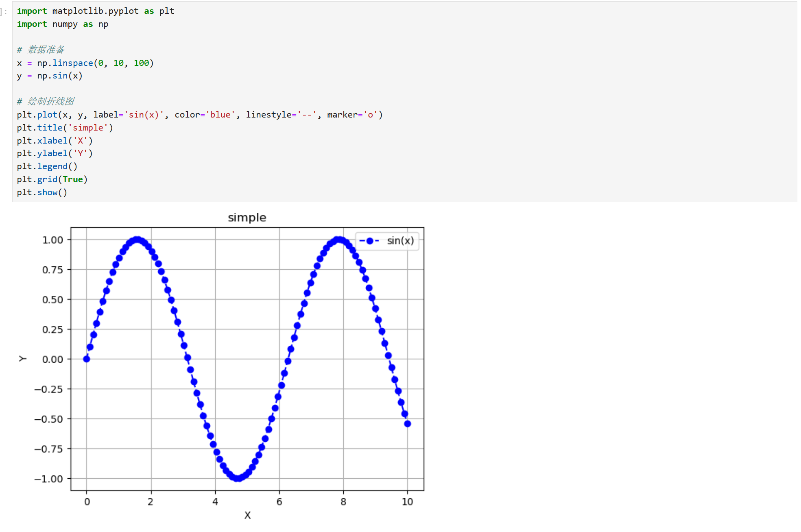

## Numpy
#### 主要的功能和代码
以下是一个表格，总结了 `NumPy` 的主要功能及其对应的代码示例：

| **功能**               | **描述**                                                                 | **代码示例**                                                                                   |
|------------------------|-------------------------------------------------------------------------|-----------------------------------------------------------------------------------------------|
| **创建数组**           | 创建一维、二维或多维数组。                                               | `arr = np.array([1, 2, 3])`<br>`matrix = np.array([[1, 2], [3, 4]])`                           |
| **数组属性**           | 获取数组的形状、大小、数据类型等属性。                                   | `arr.shape`<br>`arr.size`<br>`arr.dtype`                                                      |
| **数学运算**           | 对数组进行加减乘除、幂运算等。                                           | `result = arr1 + arr2`<br>`result = np.sqrt(arr)`                                             |
| **广播机制**           | 允许对不同形状的数组进行算术运算。                                       | `result = arr + 5`                                                                            |
| **线性代数**           | 矩阵乘法、求逆、行列式、特征值等。                                       | `np.dot(matrix1, matrix2)`<br>`np.linalg.inv(matrix)`                                         |
| **统计计算**           | 计算数组的均值、方差、标准差、最大值、最小值等。                         | `np.mean(arr)`<br>`np.var(arr)`<br>`np.max(arr)`                                              |
| **数组操作**           | 重塑数组、切片、索引、拼接、分割等。                                     | `arr.reshape(2, 3)`<br>`arr[1:3]`<br>`np.concatenate((arr1, arr2))`                           |
| **随机数生成**         | 生成随机数或随机数组。                                                   | `np.random.rand(3, 3)`<br>`np.random.randint(1, 10, size=(2, 2))`                            |
| **文件输入输出**       | 将数组保存到文件或从文件加载数组。                                       | `np.save('array.npy', arr)`<br>`loaded_arr = np.load('array.npy')`                            |
| **条件筛选**           | 根据条件筛选数组中的元素。                                               | `arr[arr > 2]`                                                                                |
| **数组排序**           | 对数组进行排序。                                                         | `np.sort(arr)`                                                                                |
| **数组复制**           | 创建数组的副本。                                                         | `arr_copy = arr.copy()`                                                                       |
| **数组填充**           | 用特定值填充数组。                                                       | `np.full((2, 2), 5)`                                                                          |
| **数组初始化**         | 创建全零、全一或未初始化的数组。                                         | `np.zeros((2, 2))`<br>`np.ones((2, 2))`<br>`np.empty((2, 2))`                                 |
| **数组拼接**           | 将多个数组沿指定轴拼接。                                                 | `np.vstack((arr1, arr2))`<br>`np.hstack((arr1, arr2))`                                        |
| **数组分割**           | 将数组分割为多个子数组。                                                 | `np.split(arr, 3)`                                                                            |
| **数组重复**           | 重复数组的元素。                                                         | `np.repeat(arr, 3)`                                                                           |
| **数组转置**           | 对数组进行转置操作。                                                     | `arr.T`                                                                                       |
| **数组扁平化**         | 将多维数组转换为一维数组。                                               | `arr.flatten()`                                                                               |
| **数组唯一值**         | 获取数组中的唯一值。                                                     | `np.unique(arr)`                                                                              |
| **数组逻辑运算**       | 对数组进行逻辑运算（与、或、非）。                                       | `np.logical_and(arr1, arr2)`<br>`np.logical_or(arr1, arr2)`                                   |
| **数组比较**           | 比较数组中的元素。                                                       | `np.equal(arr1, arr2)`<br>`np.greater(arr1, arr2)`                                            |
| **数组累积运算**       | 计算数组的累积和、累积积等。                                             | `np.cumsum(arr)`<br>`np.cumprod(arr)`                                                         |
| **数组掩码操作**       | 使用布尔掩码筛选数组元素。                                               | `arr[arr > 2]`                                                                                |
| **数组迭代**           | 遍历数组中的元素。                                                       | `for x in np.nditer(arr): print(x)`                                                           |
| **数组扩展**           | 扩展数组的维度。                                                         | `np.expand_dims(arr, axis=0)`                                                                 |
| **数组压缩**           | 去除数组中的单维度条目。                                                 | `np.squeeze(arr)`                                                                             |
| **数组堆叠**           | 沿新轴堆叠数组。                                                         | `np.stack((arr1, arr2))`                                                                      |
| **数组填充对角线**     | 填充数组的对角线元素。                                                   | `np.fill_diagonal(matrix, 5)`                                                                 |
| **数组元素替换**       | 替换数组中满足条件的元素。                                               | `np.where(arr > 2, 1, 0)`                                                                     |

---


## Pandas
#### 主要功能和代码

以下是 `Pandas` 的主要功能及其对应的代码示例的表格：

| **功能**               | **描述**                                                                 | **代码示例**                                                                                   |
|------------------------|-------------------------------------------------------------------------|-----------------------------------------------------------------------------------------------|
| **创建 DataFrame**     | 从字典、列表、NumPy 数组等创建 DataFrame。                               | `df = pd.DataFrame({'A': [1, 2], 'B': [3, 4]})`                                               |
| **读取数据**           | 从 CSV、Excel、SQL 等文件或数据库中读取数据。                            | `df = pd.read_csv('data.csv')`<br>`df = pd.read_excel('data.xlsx')`                           |
| **查看数据**           | 查看 DataFrame 的前几行或后几行。                                       | `df.head()`<br>`df.tail()`                                                                   |
| **数据信息**           | 获取 DataFrame 的基本信息，如形状、数据类型等。                         | `df.shape`<br>`df.info()`<br>`df.describe()`                                                  |
| **选择数据**           | 选择特定的列或行。                                                      | `df['A']`<br>`df.loc[0]`<br>`df.iloc[0]`                                                     |
| **条件筛选**           | 根据条件筛选数据。                                                      | `df[df['A'] > 2]`                                                                            |
| **数据排序**           | 按某一列或多列排序。                                                    | `df.sort_values(by='A')`                                                                     |
| **数据分组**           | 按某一列分组并聚合数据。                                                | `df.groupby('A').mean()`                                                                     |
| **数据合并**           | 合并多个 DataFrame。                                                    | `pd.concat([df1, df2])`<br>`pd.merge(df1, df2, on='key')`                                    |
| **数据透视表**         | 创建数据透视表。                                                        | `df.pivot_table(values='B', index='A', columns='C', aggfunc=np.mean)`                         |
| **处理缺失值**         | 检测和处理缺失值。                                                      | `df.isnull()`<br>`df.dropna()`<br>`df.fillna(0)`                                             |
| **数据去重**           | 去除重复的行。                                                          | `df.drop_duplicates()`                                                                       |
| **数据替换**           | 替换 DataFrame 中的值。                                                 | `df.replace(1, 100)`                                                                         |
| **数据转换**           | 转换数据类型或应用函数。                                                | `df['A'].astype(float)`<br>`df['A'].apply(lambda x: x * 2)`                                  |
| **时间序列处理**       | 处理时间序列数据。                                                      | `pd.to_datetime(df['date'])`<br>`df.resample('D').mean()`                                    |
| **数据导出**           | 将 DataFrame 导出为 CSV、Excel 等格式。                                 | `df.to_csv('output.csv')`<br>`df.to_excel('output.xlsx')`                                    |
| **列操作**             | 添加、删除或重命名列。                                                  | `df['C'] = df['A'] + df['B']`<br>`df.drop(columns=['C'])`<br>`df.rename(columns={'A': 'X'})` |
| **索引操作**           | 设置或重置索引。                                                        | `df.set_index('A')`<br>`df.reset_index()`                                                    |
| **数据统计**           | 计算统计量，如均值、中位数、标准差等。                                  | `df['A'].mean()`<br>`df['A'].median()`<br>`df['A'].std()`                                    |
| **数据采样**           | 从 DataFrame 中随机采样数据。                                           | `df.sample(n=5)`                                                                             |
| **数据迭代**           | 遍历 DataFrame 的行或列。                                               | `for index, row in df.iterrows(): print(row)`                                                 |
| **数据透视**           | 使用 `pivot` 方法重塑数据。                                             | `df.pivot(index='A', columns='B', values='C')`                                               |
| **数据堆叠**           | 使用 `stack` 和 `unstack` 方法重塑数据。                                | `df.stack()`<br>`df.unstack()`                                                               |
| **数据分箱**           | 将连续数据分箱为离散区间。                                              | `pd.cut(df['A'], bins=3)`                                                                    |
| **数据交叉表**         | 创建交叉表。                                                            | `pd.crosstab(df['A'], df['B'])`                                                              |
| **数据可视化**         | 使用 `plot` 方法进行简单的数据可视化。                                  | `df['A'].plot(kind='hist')`                                                                  |
| **数据连接**           | 使用 `join` 方法连接 DataFrame。                                        | `df1.join(df2, on='key')`                                                                    |
| **数据过滤**           | 使用 `query` 方法过滤数据。                                             | `df.query('A > 2')`                                                                          |
| **数据填充**           | 使用 `ffill` 或 `bfill` 方法填充缺失值。                                | `df.fillna(method='ffill')`                                                                  |
| **数据排序索引**       | 按索引排序。                                                            | `df.sort_index()`                                                                            |
| **数据多重索引**       | 创建和使用多重索引。                                                    | `df.set_index(['A', 'B'])`                                                                   |
| **数据窗口计算**       | 使用滚动窗口进行计算。                                                  | `df['A'].rolling(window=2).mean()`                                                           |
| **数据扩展计算**       | 使用扩展窗口进行计算。                                                  | `df['A'].expanding().mean()`                                                                 |
| **数据差分**           | 计算数据的差分。                                                        | `df['A'].diff()`                                                                             |
| **数据百分比变化**     | 计算数据的百分比变化。                                                  | `df['A'].pct_change()`                                                                       |
| **数据累积计算**       | 计算数据的累积和或累积积。                                              | `df['A'].cumsum()`<br>`df['A'].cumprod()`                                                    |
| **数据唯一值**         | 获取列中的唯一值。                                                      | `df['A'].unique()`                                                                           |
| **数据值计数**         | 计算列中每个值的出现次数。                                              | `df['A'].value_counts()`                                                                     |
| **数据格式化**         | 格式化 DataFrame 的输出。                                               | `df.style.format({'A': '{:.2f}'})`                                                           |

---
>? 补充
```python
# pandas -> numpy
# It can be converted to a numpy array with np.array() or to_numpy().
np.array(df)
df.to_numpy()


```

---
## Matplotlib

#### 主要功能和代码

以下是 **Matplotlib** 的主要功能及对应的常用代码，表格形式展示：  

| **功能**               | **描述**                           | **常用代码示例**                                      |
|------------------------|-----------------------------------|-----------------------------------------------------|
| 基本绘图                | 绘制简单折线图                     | `plt.plot([1, 2, 3], [4, 5, 6])`<br>`plt.show()`      |
| 散点图                  | 绘制散点图                         | `plt.scatter(x, y)`<br>`plt.show()`                   |
| 条形图（柱状图）        | 绘制条形图                         | `plt.bar(['A', 'B', 'C'], [5, 7, 3])`                 |
| 直方图                  | 绘制数据分布直方图                 | `plt.hist(data, bins=10)`                            |
| 饼图                    | 绘制饼图                           | `plt.pie([30, 20, 50], labels=['A', 'B', 'C'])`       |
| 箱线图                  | 展示数据分布及异常值               | `plt.boxplot(data)`                                  |
| 面积图                  | 绘制面积填充图                     | `plt.fill_between(x, y1, y2)`                        |
| 多子图                  | 创建多个子图                       | `plt.subplot(2, 1, 1)`<br>`plt.plot(data1)`<br>`plt.subplot(2, 1, 2)`<br>`plt.plot(data2)` |
| 设置标题和标签          | 添加图表标题与坐标轴标签           | `plt.title('Title')`<br>`plt.xlabel('X-axis')`<br>`plt.ylabel('Y-axis')` |
| 设置图例                | 添加图例以标注不同数据系列         | `plt.plot(x, y, label='Line 1')`<br>`plt.legend()`    |
| 自定义线型与颜色        | 修改线条样式、颜色与标记           | `plt.plot(x, y, linestyle='--', color='r', marker='o')` |
| 坐标轴刻度设置          | 自定义坐标轴范围和刻度             | `plt.xlim(0, 10)`<br>`plt.ylim(0, 50)`<br>`plt.xticks([0, 2, 4, 6, 8, 10])` |
| 网格线                  | 添加网格线提高可读性               | `plt.grid(True)`                                      |
| 保存图表                | 将图表保存为图片文件               | `plt.savefig('plot.png', dpi=300)`                    |
| 等高线图                | 绘制等高线图（用于3D数据分析）      | `plt.contour(X, Y, Z)`                               |
| 热力图（Heatmap）       | 显示矩阵数据的热度分布             | `plt.imshow(matrix, cmap='hot', interpolation='nearest')` |
| 3D绘图                  | 绘制三维图表（需导入 Axes3D）       | `from mpl_toolkits.mplot3d import Axes3D`<br>`ax = plt.figure().add_subplot(projection='3d')`<br>`ax.plot3D(x, y, z)` |

#### 基础示例

```python
import matplotlib.pyplot as plt
import numpy as np

# 数据准备
x = np.linspace(0, 10, 100)
y = np.sin(x)

# 绘制折线图
plt.plot(x, y, label='sin(x)', color='blue', linestyle='--', marker='o')
plt.title('折线图示例')
plt.xlabel('X 轴')
plt.ylabel('Y 轴')
plt.legend()
plt.grid(True)
plt.show()
```
<details><summary style='color:orange'>图示</summary>



</details>

## Scikit-learn

以下是 **scikit-learn**（Python中用于机器学习的库）的主要功能及对应的常用代码，表格形式展示：

| **功能**              | **描述**                             | **常用代码示例**                                      |
|-----------------------|------------------------------------|-----------------------------------------------------|
| **数据预处理**        | 数据清洗、特征选择、标准化、编码等   | `from sklearn.preprocessing import StandardScaler`<br>`scaler = StandardScaler()`<br>`X_scaled = scaler.fit_transform(X)` |
| **分类**              | 分类问题模型，如逻辑回归、决策树等   | `from sklearn.linear_model import LogisticRegression`<br>`clf = LogisticRegression()`<br>`clf.fit(X_train, y_train)` |
| **回归**              | 回归问题模型，如线性回归、SVR等     | `from sklearn.linear_model import LinearRegression`<br>`reg = LinearRegression()`<br>`reg.fit(X_train, y_train)` |
| **聚类**              | 无监督学习的聚类，如K-Means、DBSCAN等 | `from sklearn.cluster import KMeans`<br>`kmeans = KMeans(n_clusters=3)`<br>`kmeans.fit(X)` |
| **降维**              | 降低数据维度，如PCA、t-SNE等         | `from sklearn.decomposition import PCA`<br>`pca = PCA(n_components=2)`<br>`X_pca = pca.fit_transform(X)` |
| **模型评估**          | 评估模型性能，如准确率、F1分数等     | `from sklearn.metrics import accuracy_score, confusion_matrix`<br>`accuracy_score(y_true, y_pred)` |
| **交叉验证**          | 模型评估的交叉验证                  | `from sklearn.model_selection import cross_val_score`<br>`cross_val_score(clf, X, y, cv=5)` |
| **特征选择**          | 选择最相关的特征                   | `from sklearn.feature_selection import SelectKBest`<br>`X_new = SelectKBest(k=3).fit_transform(X, y)` |
| **超参数调优**        | 通过网格搜索/随机搜索调优模型参数   | `from sklearn.model_selection import GridSearchCV`<br>`grid_search = GridSearchCV(clf, param_grid)`<br>`grid_search.fit(X_train, y_train)` |
| **模型持久化**        | 保存和加载训练好的模型              | `from sklearn.externals import joblib`<br>`joblib.dump(clf, 'model.pkl')`<br>`clf = joblib.load('model.pkl')` |
| **管道（Pipeline）**   | 将数据预处理与模型训练结合          | `from sklearn.pipeline import Pipeline`<br>`pipeline = Pipeline([('scaler', StandardScaler()), ('clf', LogisticRegression())])`<br>`pipeline.fit(X_train, y_train)` |

---

#### **基础示例：使用scikit-learn进行分类任务**

```python
from sklearn.datasets import load_iris
from sklearn.model_selection import train_test_split
from sklearn.linear_model import LogisticRegression
from sklearn.metrics import accuracy_score

# 加载数据集
data = load_iris()
X = data.data
y = data.target

# 划分训练集和测试集
X_train, X_test, y_train, y_test = train_test_split(X, y, test_size=0.3, random_state=42)

# 初始化分类器
clf = LogisticRegression(max_iter=200)

# 训练模型
clf.fit(X_train, y_train)

# 预测
y_pred = clf.predict(X_test)

# 评估模型
accuracy = accuracy_score(y_test, y_pred)
print(f'模型的准确率: {accuracy:.2f}')
```

#### **常见功能细化：**

- **标准化（Standardization）：**
  ```python
  from sklearn.preprocessing import StandardScaler
  scaler = StandardScaler()
  X_scaled = scaler.fit_transform(X)  # 使特征均值为0，方差为1
  ```

- **网格搜索调优（GridSearchCV）：**
  ```python
  from sklearn.model_selection import GridSearchCV
  param_grid = {'C': [0.1, 1, 10], 'kernel': ['linear', 'rbf']}
  grid_search = GridSearchCV(SVC(), param_grid, cv=5)
  grid_search.fit(X_train, y_train)
  print(f'最优参数：{grid_search.best_params_}')
  ```

- **交叉验证（Cross-validation）：**
  ```python
  from sklearn.model_selection import cross_val_score
  scores = cross_val_score(clf, X, y, cv=5)
  print(f'交叉验证的平均准确率：{scores.mean():.2f}')
  ```

- **主成分分析（PCA）：**
  ```python
  from sklearn.decomposition import PCA
  pca = PCA(n_components=2)
  X_pca = pca.fit_transform(X)  # 将数据降至2维
  ```


#### **适用场景**
- **分类问题**：如垃圾邮件分类、情感分析等。
- **回归问题**：如房价预测、销售额预测等。
- **聚类问题**：如用户分群、图像分割等。
- **降维问题**：如数据可视化、特征压缩等。
- **模型调优**：如超参数搜索、交叉验证等。

