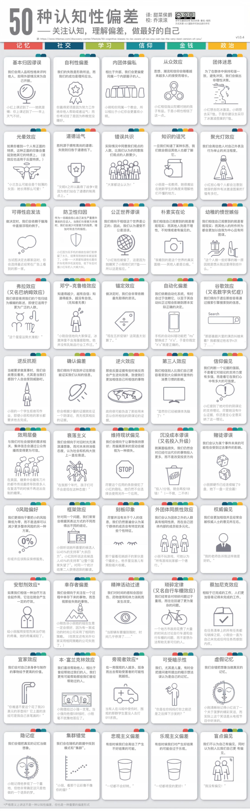

## 认知失调理论
**认知失调理论**（Cognitive Dissonance Theory）是由美国心理学家**列昂·费斯廷格**（Leon Festinger）在1957年提出的。该理论指出，人们在**持有相互矛盾的信念、态度或行为**时，会产生一种心理上的不适感，即“认知失调”。这种不适感会促使人们采取行动来减轻或消除这种不和谐的状态。认知失调理论主要解释了人类如何通过改变态度、信念或行为来减少不协调，从而恢复心理上的平衡。

### 主要内容

1. **认知失调的来源**：
   - 认知失调通常来源于**两种或多种认知之间的不一致**。这种不一致可能发生在一个人的**信念**与**行为**之间，或是**信念与信念**之间。例如，一个人认为吸烟有害健康，但同时又有吸烟的习惯，这种情况下会产生认知失调。

2. **失调的强度**：
   - 失调的强度取决于认知之间的**重要性**和**冲突的程度**。越重要的信念之间的冲突，失调感越强。失调程度还受到人们对该行为是否出于自己意愿的认知影响。

3. **减少认知失调的方式**：
   - **改变行为**：例如，意识到吸烟有害健康后，选择戒烟以消除失调。
   - **改变信念**：例如，吸烟者可能会说服自己“偶尔吸烟无害”来减少失调。（反驳、说服）
   - **增加新的认知**：人们可能会寻找合理化的理由来减少失调，如“吸烟让我放松”。
   - **避免失调的认知**：通过回避让人产生矛盾的事物，减少内心的冲突感。（否认、回避）

#### 实验与应用

费斯廷格的**认知失调实验**，尤其是**1美元和20美元实验**，展示了人们如何在报酬不同的情况下调整自己对枯燥任务的态度。这项实验显示，接受较少报酬（1美元）的人们为了减少失调，倾向于认为任务其实“并不那么无聊”。

认知失调理论广泛应用于**社会心理学**、**消费者行为学**、**组织行为学**等领域。它帮助解释了人们在面对不一致的态度与行为时的反应。例如，消费者在购买高价商品后可能会产生“买贵了”的心理不适感，这时他们会通过强调商品的高品质来减少失调。

**确认偏误**（Confirmation Bias）是指人们倾向于**寻找、解释、偏爱和记住那些支持其既有信念或假设的信息**，同时忽视或排斥那些与之相矛盾的信息。这是一种常见的认知偏差，会影响人们的判断和决策过程，使他们更容易坚持原有观点，而不愿接受新的、相反的证据。

## 确认偏误

是个人选择性地回忆、搜集有利细节，忽略不利或矛盾的信息，来支持自己已有的想法或假设的趋势[2][3][4]，属于认知偏误的其中一类以及归纳推理中的一个系统性错误。

#### 确认偏误的表现

1. **信息选择偏好**：
   - 人们会主动选择接触那些符合自己观念的信息来源。例如，持有某种政治立场的人会倾向于观看与其立场相符的媒体，避免与其观点相悖的内容。

2. **解释的偏差**：
   - 对于同一条信息，不同的人可能会根据自身的偏见进行不同的解释。例如，一个人在阅读同一篇新闻时，可能会根据自己已有的立场来选择性地理解和解释新闻内容，从而让该信息支持自己的信念。

3. **记忆的偏差**：
   - 人们往往更容易记住那些与自己观点一致的信息，而忘记或忽视相反的信息。这种选择性记忆可以帮助他们在未来继续强化自己的观点。

4. **只关注支持证据**：
   - 在收集和分析数据或证据时，人们可能会只关注支持自己结论的证据，忽视反对证据。例如，在科学研究中，如果研究者已经有了一个假设，确认偏误可能会促使他们选择性地忽视与假设不符的数据。

#### 确认偏误的原因

1. **认知简化**：
   - 人类大脑在面对大量信息时，往往会选择性地简化信息处理过程，而确认偏误是这种简化的一部分。通过只关注符合已有信念的信息，可以减少对认知资源的需求，使得信息处理更为容易。

2. **心理舒适**：
   - 接受与自己信念相符的信息可以带来心理上的舒适感，而与之相反的信息可能引发不适感或焦虑。因此，人们倾向于回避这些不愉快的感觉，通过忽视或否认相反的信息来维持内心的平衡。

3. **自我保护机制**：
   - 确认偏误也可以被视为一种自我保护的机制，因为质疑自己长期以来的信念可能会对自我概念带来冲击。通过忽视或拒绝与自己观点相悖的信息，人们可以保护自己的自尊心和自信心。

#### 确认偏误的影响

确认偏误可能会导致人们**固守成见**、**拒绝改变**，甚至导致**决策失误**。在科学研究、新闻阅读、社会交往中，确认偏误都可能让人们更加固执己见，忽视其他可能性。

#### 如何减少确认偏误

1. **意识到偏误的存在**：
   - 了解和承认确认偏误是一种普遍的心理现象，可以帮助人们在做决策时更加警惕，努力避免它的影响。

2. **主动寻找反面证据**：
   - 在评估某个问题或做决定时，有意识地寻找和考虑与自己观点相反的证据，以确保观点的全面性。

3. **借助他人视角**：
   - 听取他人，尤其是不同意见的人的观点，可以帮助我们打破思维定式，避免陷入确认偏误的陷阱。

4. **进行逻辑检验**：
   - 通过理性的推理和客观的分析，审视自己的观点是否有充足的证据支持，避免因偏见导致错误的结论。

### 不可挑战的信仰
**不可挑战的信仰**（Unchallengeable Belief），通常指的是一种深深根植于个体思想和情感之中的信念，这种信念往往具有**不可动摇性**，并且个体在面对与之相冲突的信息或证据时，也不会轻易改变。这种信仰可以源于宗教、政治、文化、道德、个人价值观等方面，通常带有强烈的情感依附。

#### 不可挑战信仰的特点

1. **抗拒改变**：
   - 不可挑战的信仰通常是个人核心身份的一部分。即使面对强有力的证据或合理的反对意见，个体也不愿意改变自己的信念，因为这样做可能会引发强烈的心理不适或失落感。

2. **情感上的依附**：
   - 不可挑战的信仰通常带有深厚的情感依附，例如宗教信仰、对民族的热爱或道德准则。这种情感依附增强了信仰的不可动摇性，使得个体在遇到质疑时更倾向于捍卫信仰。

3. **确认偏误与认知失调**：
   - 持有不可挑战信仰的人往往会表现出**确认偏误**（只接受支持信仰的证据，忽视相反证据）和**认知失调**（遇到矛盾信息时通过否认、反驳或重新解释来维持信念）。

4. **社交和文化环境的支持**：
   - 社交圈、社区或文化环境中持有相同信仰的群体也会强化这种信念。在这样的群体中，持不同信仰的人可能会被孤立或排斥，因此个体更有可能坚守其信仰。

#### 不可挑战信仰的形成原因

1. **社会化过程**：
   - 很多不可挑战的信仰是在社会化过程中形成的。例如，家庭、学校、宗教机构或社会的价值观塑造了人们对世界的理解和判断标准，这些信仰一旦形成就难以改变。

2. **情感和个人身份的结合**：
   - 当一个信仰被视为个人身份的一部分时，它变得更难被动摇。因为挑战这种信仰，不仅是质疑一个观点，还可能被视为对个人身份的威胁。

3. **生存和心理上的安全感**：
   - 一些不可挑战的信仰能够提供**心理上的安全感**和**存在的意义**，特别是在面对不确定性或困境时。例如，宗教信仰可以提供一种超越个人的终极意义，使人们在困难中获得力量。

#### 不可挑战信仰的影响

1. **积极影响**：
   - 不可挑战的信仰可以为个体提供**心理安慰**、**价值导向**，让人们在生活中找到意义和目标。在困难时期，这种信仰能提供情感支持，帮助个体克服逆境。
   
2. **消极影响**：
   - 不可挑战的信仰可能导致**偏见**和**排他性**，个体对持有不同信仰的人或信息表现出敌意。此外，过于坚定的信仰可能会导致**思想僵化**，阻碍人们接受新信息或适应社会变化。

## 50种认知偏差

认知偏差图

#### 记忆
1. **基本归因错误**：倾向于把他人的行为归因于个人特质，而非情境因素。
   - 例：小王迟到被认为是他懒散，而不考虑路况问题。

2. **光环效应**：对某人一个积极特质的印象影响对其整体评价。
   - 例：“小李看起来很专业，一定工作能力也很强。”

3. **可得性启发法**：更容易记住和使用容易想起的信息来判断事件概率。
   - 例：新闻频繁报道空难，导致人们认为坐飞机很危险。

4. **锚定效应**：在做决策时，最先接触到的信息会对后续判断产生很大影响。
   - 例：在商场看到“原价100元，现在50元”的标价，认为打折后价格很划算。

5. **维持现状偏见**：人们倾向于维持现状，不愿意做出改变。
   - 例：即使现有工作不满意，也不愿意换新工作。

6. **安慰剂效应**：相信某种无效措施有效果，仅仅因为自己相信。
   - 例：服用维生素片后觉得身体更有活力，即使没有实质效果。

#### 社交
7. **自利性偏差**：将成功归因于自己，将失败归因于外部环境。
   - 例：小李得到好成绩认为是努力学习，考差了则归因于题太难。

8. **道德运气**：对行为结果的评价受到其后果的影响。
   - 例：“文艺演出得到了奖项，所以策划人员非常优秀。”

9. **防卫性归因**：将坏事归因于受害者，以减少对自己类似情况的担忧。
   - 例：听说有人被骗，认为是因为他太轻信别人。

10. **邓宁-克鲁格效应**：能力欠缺的人往往对自己的能力过于自信，而高能力者则会低估自己。
    - 例：刚开始学编程的人认为自己已经很擅长，而实际水平很低。

11. **弗拉效应（又名巴纳姆效应）**：人们倾向于接受一些模糊而笼统的描述，认为这些描述非常符合自己的个性或情况。
    - 例：看星座运势时觉得内容特别符合自己，认为占星学很准。

12. **第三人效应**：认为别人更容易受媒体影响，而自己不会。
    - 例：认为自己不会被广告左右，但觉得别人会受广告影响。

13. **袒护主义**：过度保护某人或某事，即使他们犯错也不惩罚。
    - 例：父母对孩子过分溺爱，即使孩子犯错也不责骂。

14. **刻板印象**：对某群体成员的特质有固定的看法。
    - 例：认为某国人都不友好，因为对该国的负面印象深刻。

15. **聚光灯效应**：高估他人对自己的关注程度。
    - 例：小张穿了新衣服，认为所有人都在关注他。

16. **外团体同质性效应**：认为外部群体的成员都是相似的，内部群体则更具多样性。
    - 例：认为其他学校的学生都一样，而自己学校的学生更有个性。

#### 学习
17. **内团体偏私**：更倾向于对待与自己有相同特质的群体成员。
    - 例：小组讨论中，更倾向于支持和自己背景相似的组员观点。

18. **错误共识效应**：认为其他人也和自己持相同的看法。
    - 例：“大家都认为我说的是对的！”

19. **公正世界谬误**：认为世界是公平的，坏事只会发生在“坏人”身上。
    - 例：“小李被辞退了，他一定是工作表现不佳。”

20. **自动化偏差**：过度依赖自动化系统，忽视自己的判断。
    - 例：GPS导航出错时，仍然按照错误指示行驶，而不根据路况判断。

21. **谷歌效应（又名数字失忆症）**：依赖网络搜索而忽视记忆信息的习惯。
    - 例：有问题就上网查，完全不记住信息，因为认为随时可以再查。

22. **框架效应**：同样的信息以不同方式表达会导致不同的反应。
    - 例：产品描述“成功率90%”比“失败率10%”更容易让人接受。

23. **朴素实在论**：人们普遍相信他们所看到、听到或感知到的世界是客观真实的。
    - 例：“我看到这个世界是都是真实的。”

#### 信仰
24. **从众效应**：受他人行为影响而趋于做相同选择。
    - 例：小组成员选择某方案，其他人也倾向于选择相同方案。

25. **知识的诅咒**：对一个领域了解越多，越难理解他人的无知。
    - 例：“这个问题很简单啊，为什么别人不懂？”

26. **逆反抗拒**：当被强迫时，人们倾向于拒绝或反其道而行之。
    - 例：小明的父母禁止他玩游戏，反而让他更想玩。

27. **确认偏差**：人们倾向于寻找和重视支持自己已有信念的信息。
    - 例：只阅读支持自己观点的新闻，忽视其他声音。

28. **逆火效应**：在面对反驳时，原有信念反而更加坚定。
    - 例：有人试图劝小李戒烟，反而让小李更加抗拒戒烟。

29. **信仰偏见**：人们更倾向于相信符合自己信仰的信息，忽视相反的信息。
    - 例：小王坚持不吃肉，认为所有的研究都表明素食对健康最好。

#### 金钱
30. **效用层级**：根据效用高低来决定资源分配。
    - 例：在公司资源分配中，高层获得更多资源，低层获得较少。

31. **沉没成本谬误（又名投入升级）**：因为已经投入了资源，即使不合理也继续投入。
    - 例：在股票亏损时不愿止损，认为已经投了很多钱。

32. **0风险偏好**：倾向于选择完全无风险的选项，即使它的回报较低。
    - 例：宁愿选择保本的理财产品，而不考虑更高回报但有风险的投资。

33. **赌徒谬误**：认为随机事件是有规律的，过去的事件会影响未来的结果。
    - 例：连续投掷硬币出现正面，认为下次会更可能出现反面。

#### 政治
34. **团体迷思**：为了保持群体和谐，压制不同意见，导致群体决策失误。
    - 例：小组讨论时，为了不引起冲突，成员们都同意一个不太理想的方案。

35. **权威偏见**：更容易相信权威人士的观点，即使没有验证。
    - 例：医生推荐的保健品会更被信任，尽管没有科学依据。

36. **幼稚的惯世媒体偏误**：受特定媒体观点影响，产生不准确的世界观。
    - 例：“新闻说这个地区不安全，我一定不能去。”

#### 其他
37. **幸存者偏差**：倾向于只关注成功案例，忽略失败的情况。
    - 例：只看到创业成功的人，忽略失败者，从而高估创业成功率。

38. **精神活动过速**：过度关注细节，导致忽略整体。
    - 例：在面试时紧张地关注自己的肢体动作，忽视面试官的问题。

39. **珀碎全律（又名自行车棚效应）**：在简单决策上花费过多时间，而对复杂问题避而不谈。
    - 例：会议中花大量时间讨论购买小物品，而忽略重要预算决策。

40. **累加厌恶效应**：人们倾向于选择分散的多项奖品而非一个大奖。
    - 例：在抽奖中更希望获得多个小奖而非一个大奖。

41. **宜家效应**：倾向于更重视自己付出劳动的物品或成果。
    - 例：亲手组装的家具，觉得比商店现成的更有价值。

42. **本-兰克林效应**：当我们为他人做过好事时，会更加喜欢他们。
    - 例：为同事帮忙后，觉得对方人很好。

43. **劳累者效应**：长期的劳累会影响判断力，导致更多的错误。
    - 例：连续工作12小时后，判断问题变得困难。

44. **可爱展示性**：人们倾向于对可爱事物做出积极评价。
    - 例：即使不实用的小玩意，因为设计可爱而购买。

45. **虚假记忆**：由于误导或不正确的信息，产生伪造的记忆。
    - 例：被反复询问某事，最后自己相信事情真的发生过。

46. **隐记症**：对过去的负面经历或细节进行选择性遗忘。
    - 例：对于不愉快的经历，大脑会选择性遗忘细节。

47. **集群错觉**：误以为随机事件中有模式可循。
    - 例：买彩票时觉得某些号码“更有可能中奖”。

48. **悲观主义偏差**：倾向于预期最坏的情况发生。
    - 例：对未来感到悲观，认为事情总会出问题。

49. **乐观主义偏差**：对未来过度乐观，低估风险。
    - 例：在投资时只看到收益而忽视可能的损失。

50. **盲点偏见**：认为自己不受偏见影响，但他人会。
    - 例：认为自己做决定时客观理性，而他人被偏见左右。

