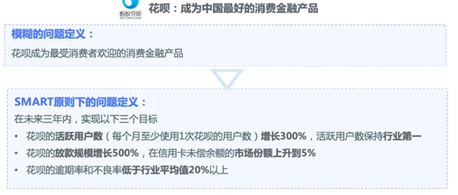
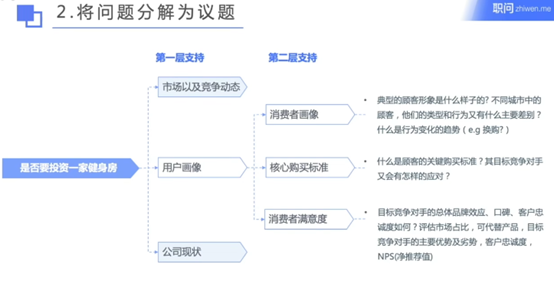
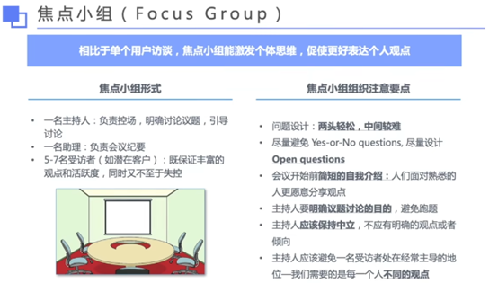

## 7步成诗法
### i.	界定问题（怎么样提高院线单月利润？增加收入/降低成本）
    
- 1.分析老板提出问题的动因

    董事会对院线的盈利状况不满意？

    竞争对手比我们更赚钱？

- 2.问题界定的特点（SMART原则）

    

    
图片示例 >>

    - 
    - 

    

       
- 3.使用议题树分解问题

    

    
图片示例 >>

      

    

    

    

    

    

     
    

### ii.	将问题分解成议题

- 1.增加收入：增加票房收入/增加广告、小卖部等非票房收入

- 2.减少成本：减少固定成本/减少可变成本（减少人力成本，增加自动取票机）

    

### iii.	去除不重要的议题

- 1.票房收入难以增加（非影院可控）×

- 2.固定成本难以降低（房租设备等）×

- 3.80/20原则

- 4.制定有限的排序标准（影响、紧急程度、实施难度、风险）

    

    
 
### iv.	制定详细的工作计划，收集数据

- 1.	引入对唱吧、收费按摩椅、3D眼镜租赁等新业务调研

- 2.	对现有工作人员进行调研评估
        
- 3.	可以使用甘特图
    
    

    
 
### v.	分析重要议题

 
### vi.	汇总研究成果、建立论据

### vii. 准备你的故事（给出明确方案）

- 1.Who（责任人）---谁来做？

- 2.When（时间节点）---什么时候做？

- 3.How（如何落地）---怎么做？--引入新业态、削减人员规模
 
 

## 进行高效简洁的信息收集
### b)	咨询公司常见信息搜集整理方法对比

整理方法对比 >>

 

 

 
 

 
 
 
 
 
 
c)	案例
 
 
 
 
 
 
 
