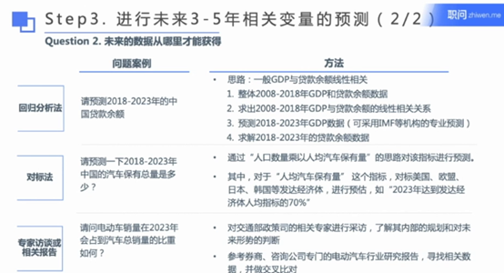

 
## 市场规模测算方法

1. **两种主要方法**：
   - **TOP DOWN（自上而下）**：
     - 偏于宏观层面的估算。
     - 基于对整体发展的考量。
     - 测算速度相对较快，但精度相对较低。

   - **BOTTOM UP（自下而上）**：
     - 考虑该市场的各个细分市场。
     - 该市场的各类驱动因素。
     - 测算更加精确，过程相对复杂。

2. **结合使用**：
   - 通过两种方法的结合，检验测算结果，使得测算精度更高。

3. **注意要点**：
    
   - 通过进行市场测算，了解市场的整体规模和预测未来的增速，为企业制定战略和发展目标奠定基础和方向。
   - 没有完全准确的市场测算，都是基于事实的推测。

### 自上而下测算

1. **定义和应用**：

   - **大市场到小市场**：从全球市场到亚太市场，再到中国市场，逐步细化。

   - **与宏观发展要素相关**：利用GDP、人口、进出口总额等宏观数据，进行同位分析和预测。

   - **同类对标**：例如，对标美国、欧洲、日本等市场类似发展路径的时期规模。

2. **优势**：

   - 测算方式相对简单。

   - 测算结果得到较快。

3. **劣势**：
   - 需要相关数据支持，且需要考虑可得性。

   - 方法较为粗略，缺少细节支持。

4. **适用情境**：

   - 已知要求市场更大范围的市场规模（如全球市场）或宏观数据（如GDP）。

   - 需要快速了解一个市场的量级。

5. 

 5.自上而下方法的公式和案例>>

    
    
    
    
  

?> 该方法主要适用于快速测算市场规模，尤其是在数据宏观层面可以获得的情况下，通过参考大市场数据推测细分市场。

###	自下而上测算

1. **定义和应用**：

   - **细分市场加总**：将市场拆解成A、B、C、D等若干小市场或区域，再逐一进行测算。

   - **市场强相关元素**：考虑影响市场的关键因素，如增长速度/用电规模/游客人数。

   - **发展驱动因素**：分析核心因素，如渗透率、价格、生产要素等。

2. **优势**：

   - 测算细致，精确度相对较高。

   - 可以对局部结果进行微调。

3. **劣势**：

   - 较耗时且过程复杂。

   - 需要更多假设设作为前提条件。

4. **适用情境**：

   - 需要细致测算行业发展趋势和背后原因的测算情景（如各个细分市场的分别趋势）。

   - 当缺少宏观或整体数据信息的时侯。

5. 

 自下而上方法的公式和案例>>

    
    

  

?>该方法适用于需要更高精度的市场测算，尤其在细分市场数据可获得的情况下，可以逐层构建整体市场规模。 

#### 渗透率
渗透率（Penetration Rate）的公式通常用于衡量某产品或服务在特定市场中的普及程度。计算公式如下：

$$
\text{渗透率} = \frac{\text{使用该产品或服务的用户数量}}{\text{总潜在市场用户数量}} \times 100\%
$$

- 示例解释：
    - **使用该产品或服务的用户数量**：实际已经使用或购买该产品/服务的用户数量。
    - **总潜在市场用户数量**：在目标市场中，可能会使用或有能力购买该产品/服务的所有潜在用户数量。

- 示例：
    如果一个城市中有100万人口，其中有20万人使用某款手机应用，则该应用在该城市的渗透率为：

    $$
    \text{渗透率} = \frac{200,000}{1,000,000} \times 100\% = 20\%
    $$

    渗透率越高，说明该产品在市场中的普及程度越高。

 
## 市场规模预测框架

### 四步法

#### Step1. 列出行业的分析框架  
- 搭建有效的行业分析框架，以便进行系统性的市场规模预测。

- 分为 _**客户渗透率分解法**_ 和 _**细分行业品类法**_
    
    - 

 客户渗透率分解法>>

      

      

    - 

 细分行业品类法>>

      

      

    - 

 框架搭建要点>>

      

      

#### Step2. 按照分析框架列出历史数据  

- 从合适的来源获取历史数据，为预测提供可靠的基础。
    

列出历史数据>>

    

    

#### Step3. 进行未来3-5年相关变量预测 

- 对未来几年的关键变量进行预测，为市场规模估算提供支持。

    

变量预测>>

    
    

    

#### Step4. 对市场预测模型进行归纳、思考  

- 反思预测模型的有效性，确保结果的准确性和实用性。

    

变量预测>>

    

    

这些步骤和问题旨在帮助建立一个系统化的市场规模预测流程，从数据收集到未来预测，再到结果分析。
 
 
### 案例分析
- 

以天然气行业的案例>>

    
    
    
    

  

- 

以健身行业的案例>>

    

    

    

    

  

 
 
 
 
 
 
 
 
## 细分市场 

#### 如何从零开始研究产业链构成

### 1. 通过文献研究建立对产业的基本理解
   - 通过快速学习的三步：
     1. 百度或Google搜索（比如快递行业深度报告）
     2. 行业研究报告
     3. 学术文献
   - **注意事项**：要注意**速度**和**阅读量**的平衡。`（快速阅读确定重点，把重点截图放到笔记）`

### 2. 通过补充研究进行完善
   - 针对缺失的知识模块，快速进行补充研究，包括：
     1. 资料补全（同上三步）
     2. 专家访谈
     3. 一线调研
   - **注意事项**：要注重**批判性思考**，对一手和二手信息进行翻译和判断。

### 3. 理清不同环节之间的交互关系
   - 对图谱中的各个主体之间的关系进行梳理，包括从信息流、货流、资金流等角度进行多次梳理。
   - 主要内容：
     - 产业链信息流
     - 货流
     - 资金流

以上流程从建立产业的基本理解开始，通过补充知识模块进行完善，最终理清产业链各环节的交互关系，以便全面理解产业链。

