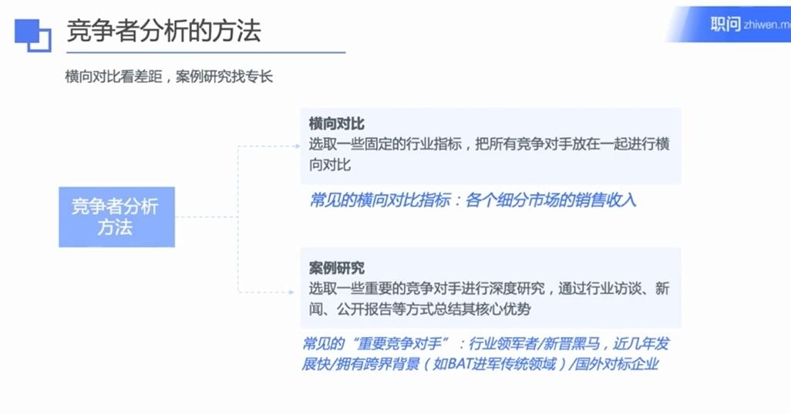

## 细分市场 

### 如何从零开始研究产业链构成

#### 1. 通过文献研究建立对产业的基本理解
   - 通过快速学习的三步：
     1. 百度或Google搜索（比如快递行业深度报告）
     2. 行业研究报告（快速浏览定位有效信息，截图保存笔记本）
     3. 学术文献
   - **注意事项**：要注意**速度**和**阅读量**的平衡。`（快速阅读确定重点，把重点截图放到笔记）`

   

   

#### 2. 通过补充研究进行完善
   - 针对缺失的知识模块，快速进行补充研究，包括：
     1. 资料补全（同上三步）
     2. 专家访谈
     3. 一线调研
   - **注意事项**：要注重**批判性思考**，对一手和二手信息进行翻译和判断。

   

#### 3. 理清不同环节之间的交互关系
   - 对图谱中的各个主体之间的关系进行梳理，包括从信息流、货流、资金流等角度进行多次梳理。
   - 主要内容：
     - 产业链信息流
     - 货流
     - 资金流

   

   

#### 4. 确定重点环节并进行分析

##### 如何确定重点环节
   - ***参考已有报告和观点***
      - 在专家访谈中，习惯性会问的两句话：
         1. “您认为这个产业中最核心的环节是哪几个呢？”
         2. “我们一般会怎样来概括这个产业链呢？分别有哪些环节？”

   - ***通过关键指标进行自主归纳和整理***
      - 合并同类项：  
         - 相似的动作可以归纳为一个环节，例如快递行业中的“揽件与收件”。

      - 通过产值判断：  
         - 产值占比高的一般是重点环节，例如快递行业中的“长途运输”环节。

##### 重点环节分析

重点环节的分析需结合竞争态势与行业关键因素，综合运用定量与定性分析工具，深入解读市场环境与变化趋势。

以下是重新整理、格式更清晰的表格：

---

### 重点环节分析的维度和方法

| **分析维度**         | **可参考指标**                      | **信息来源**                          | **解读方式**                                                                 |
|----------------------|-------------------------------------|---------------------------------------|------------------------------------------------------------------------------|
| **竞争态势**         | - 行业集中度 - 领先企业数量及特点 | - 行业分析报告 - 自己简单估算       | - **前10家或5家公司集中度判断**：   - `<20%` ：集中度低,同质竞争激烈   - `>80%`：集中度高        |
| **市场规模**         | - 总规模 - 增速                  | - 行业分析报告 - 上市公司招股说明书 | - **规模**：100亿以下的市场不算大市场 - **增速**：一般对标GDP增长率，6-8%的增速为底线 |
| **盈利能力**         | - 利润率（毛利润率） - 投资回报率 | - 行业分析报告 - 上市公司年报 - 专家访谈 | - **利润率**：一般对标资金成本（银行贷款利息），3-4%为底线                       |
| **其他关键态势**（视行业而定） | - 金融行业：监管趋势 - 汽车行业：外资准入政策变化 - 消费品：用户洞察 | - 政府监管机构网站 - 记者深度报道和解读文章 - 咨询律师  -消费者问卷调查或访谈 | - **监管解读**：监管层级分析，例如完全不可参与或不可控股的环节   - **用户洞察**：定量或者定性研究方法分析              |

#### 案例分析

以快递行业的案例>>

以健身房行业的案例>>

以私募股权行业的案例>>

