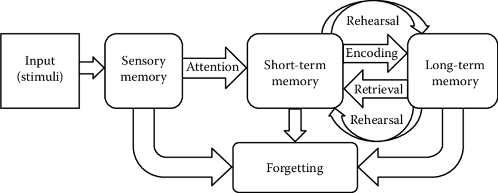

## 短期记忆与长期记忆
人的记忆的种类通常分为“大体的短期记忆”和“长期记忆”，这是由阿特金森与希夫林（Atkinson and Shiffrin）所提出的**记忆的三重贮藏模型**中区分的方式。

此外，还有“感觉记忆”与短期记忆之间的转换记忆“作动记忆”等名称。

#### 记忆的主要种类

1. **感觉记忆**
   **感觉记忆**是信息进入记忆系统的第一个阶段，即信息通过感官（如视觉、听觉等）进入并进行瞬时的存储。感觉记忆的特点是容量较大，但保持时间极短，仅为几毫秒到几秒钟。  
   - **视觉记忆（Iconic Memory）**：对视觉信息的短暂记忆，持续时间约为0.5秒。
   - **听觉记忆（Echoic Memory）**：对听觉信息的短暂记忆，持续时间约为3-4秒。

- **短期记忆（一次记忆）**
   **短期记忆**是对少量信息的暂时存储，通常能保持约15-30秒，且存储容量有限，大约为7±2个信息单元（如数字或词语）。短期记忆通过反复“复述”可以将信息保持更长时间，否则信息很快会被遗忘或替代。短期记忆通过反复“复述”，可以让信息在记忆中保留一段时间，因此有时称为“工作记忆”。

   - **工作记忆（作动记忆）**
      “工作记忆”或称“作动记忆”，在超越短期记忆的信息处理中发挥着重要作用，主要负责暂时的保存、处理信息的功能。工作记忆较短期记忆的特征是具有处理信息的能力，这种功能在学习或信息操作时扮演重要角色。
      Baddeley & Hitch（1974）提出了目前的工作记忆理论模型，认为是通过“中央执行系统”来控制和维持的三种记忆系统组成。
      - **1. 语音回路（语言信息存储）**：负责维持语言信息的存储。
      - **2. 视觉空间工作区**：负责处理视觉与空间的信息。
      - **3. 中央执行系统**：负责编排、任务管理。

- __长期记忆（二次记忆）__
   **长期记忆**是信息的持久性存储系统，其容量几乎是无限的，且存储时间可以从几天、几年到终生。信息在长期记忆中经过编码和组织，以便日后能够提取和使用。
   “长期记忆”是将重要的知识与事件等长时间存储的记忆。短期记忆保存并转化的信息，有部分会转入长期记忆中，长期记忆的容量大致为“无限大”。
   
   长期记忆的内容分为“显性记忆”（显性的记忆）和“隐性记忆”（隐性的记忆）两种:
   - **显性记忆（陈述性记忆）**：有意识的记忆，包括：
      - **情节记忆（Episodic Memory）**：关于个人经历的记忆，如某个生日派对的回忆。
      - **语义记忆（Semantic Memory）**：关于一般知识和事实的记忆，如知道地球是圆的。
   - **隐性记忆（非陈述性记忆）**：无意识的记忆，包括：
      - **程序记忆（Procedural Memory）**：关于如何做事情的记忆，如骑自行车、打字等技能。
      - **条件反射**：由经典条件反射和操作性条件反射建立的无意识记忆。
      - **启动效应**: 启动效应是指先行刺激对后续刺激的促进效果。也存在先行刺激对后续刺激的抑制效果，称为“负启动效应”。
         

启动效应

         **启动效应**（Priming Effect）是指先前的刺激或经验会无意识地影响个体对后续刺激的反应、判断或行为的心理现象。
         简单来说，当我们接触到某些信息或刺激后，这些信息会在潜意识中影响我们随后的思考和行动。
         知觉性启动效应包括以下两个测量方法：**知觉性启动（重复启动）**和**语义性启动（通过语义关联的促进过程）**。

         - 启动效应有多种形式，每种形式在不同的情境中对后续的反应或判断产生不同的影响：

            1. **知觉性启动**  
               知觉性启动是指，当人们在视觉、听觉等知觉层面上接触过某个信息后，再次遇到类似信息时，反应会更快。\
               例如，如果一个人看过某个词的部分片段，当再次看到完整的词时，更容易识别出该词。

            2. **语义性启动**  
               语义性启动是指，一个概念会影响到与其含义相关的其他概念。\
               例如，当看到“医生”这个词时，人们对“护士”或“医院”这样的词会产生更快的反应，因为它们在语义上是相关的。

            3. **情境性启动**  
               情境性启动是指特定的环境或情境会影响个体在类似情境下的行为或反应。\
               例如，当一个人曾在某个地方听到某首歌，之后在类似情境中听到相同的歌曲时，容易引发类似的情绪或记忆。

         - 启动效应的影响

            启动效应在日常生活中会对人们的判断、行为和记忆产生潜移默化的影响：

            - **影响判断和行为**  
            启动的刺激会无意识地影响人们的判断和决策。\
            例如，如果先看到与“成功”相关的词汇，人们在随后的任务中可能会表现得更有信心和积极性。

            - **促进记忆的唤起**  
            当过去的经历或知识被启动时，相关的记忆更容易被唤起。\
            例如，当听到某个熟悉的旋律时，容易联想到过去的经历。

         - 启动效应的实例

            - **广告**：通过反复接触某个品牌的广告，消费者在购物时更可能选择这个品牌。
            - **教育**：给予学生积极的反馈会提升他们的学习动力，并可能提高他们的学习表现。
            - **情绪**：观看悲伤的电影后，人们可能在一段时间内做出更为悲观的判断，这表明情绪也会受到启动效应的影响。

            启动效应广泛存在于日常生活中，虽然我们通常没有意识到它的存在，但它确实在无形中影响着我们的认知和行为。
         
   

  

#### 模型的工作原理

    
    
记忆的三重贮藏模型

在三重贮藏模型中，信息按顺序从感觉记忆传递到短期记忆，再通过复述或编码进入长期记忆。这一过程主要依赖于以下机制：
- **注意力**：帮助信息从感觉记忆进入短期记忆。
- **复述**：帮助信息在短期记忆中停留更长时间，增加进入长期记忆的机会。
- **编码**：信息在长期记忆中通过语义或视觉等编码方式存储，便于日后提取。
- **提取**：长期记忆中的信息通过提取过程重新回到短期记忆，以便使用。

#### 三重贮藏模型的意义
阿特金森和希夫林的三重贮藏模型为理解人类记忆的结构和功能提供了框架，奠定了认知心理学对记忆研究的基础。尽管模型较为简单，但它清晰地描述了记忆如何从感觉输入逐步转化为持久的长期记忆。

这个模型的提出引发了关于记忆系统的更多研究，为后来的记忆理论和信息处理理论提供了理论支持。例如，巴德利和希奇提出的工作记忆模型进一步扩展了短期记忆的概念，将其解释为信息存储和操作的多元系统。

---

## 展望记忆・自传体记忆

展望记忆是指对将来需要完成的任务的记忆，通常被称为“日常记忆”。展望记忆也称为目标记忆。  
此外，还包括对自己曾经行为的记忆。这是一种未来要做的事情或要完成的行动的记忆，例如与朋友的约会、周末去书店等，属于展望记忆的范畴。是关于未来行为的记忆。

自传体记忆是指关于个人自身经历的记忆，与个人日常生活密切相关的记忆内容。  
自传体记忆的内容多集中在10到20岁期间的经历，这一现象被称为**“回忆高峰”**（Reminiscence Bump）。

---

## 记忆的过程

记忆是指，通过经验所引起的行为变化的保持过程。记忆的过程分为以下三个阶段：（1）编码、（2）储存、（3）提取。  
心理学上，为了便于理解，信息科学中的术语“写入（编码）、保存（储存）、读取（提取）”被用来描述记忆过程。

1. __记忆的过程（1）编码（符号化）__

    **编码**（符号化）是指，将获取的信息转化为记忆中可以存储的形式。这是将外部信息转化为内在表征的过程。  
    人类的编码过程包括视觉的“图像记忆”与听觉的“声音记忆”等信息的输入。通过短时记忆（例如通过声音记忆获得的信息），输入的信息通过复述进入长期记忆并储存。  
    在短期记忆中，复述会有助于信息的维持，复述包括将注意力集中于信息上以便重新调用的过程，这种复述称为“维护型复述”与“精细型复述”。

2. __记忆的过程（2）储存（贮藏）__

    **储存**（存储）是指，将编码后的信息放在记忆中并维持的过程。通过有效的信息储存，记忆信息得以保存不丢失。  
    例如，短时记忆中所保存的信息被传递至长时记忆，保持时效较长。记忆的生理基础是大脑的神经元突触之间的连接及活性化，这样的强化路径使得信息长期储存在大脑中。

3. __记忆的过程（3）提取（搜索）__

    **提取**（检索）是指，将储存的记忆从记忆中重新取出的过程。提取包括再生、再认、再构成等方式。  
    - **再生**：没有提示的情况下复述所学内容。
    - **再认**：通过外部提供的线索确认已储存的内容。
    - **再构成**：通过各种线索重建先前的记忆内容。

4. __记忆的测量法：再生法・再认法__

    记忆的测量方法主要分为“再生法”和“再认法”。  
    - **再生法**：即在没有提示的情况下回忆起信息的方法。  
    - **再认法**：即在提供提示的情况下识别记忆的方法。  
    例如，在学习中，老师会用选择题（再认法）来测试知识的掌握情况，而用填空题（再生法）来检测学生记忆的深度。

---

## 元记忆・元认知

**元认知**（Metacognition）和**元记忆**（Metamemory）是心理学中两个密切相关的概念，主要涉及个体对自己认知过程的认识和调节。下面是对它们的详细解释：

---

### 元认知

**元认知**是指对自己认知过程的认知，简单来说就是“对思考的思考”或“对认知的认知”。它包括对自己的思维、学习、记忆和问题解决过程的意识、监控和调节。

元认知包括两个主要方面：
1. **知识层面**：包括个体对自己认知能力和过程的理解，例如自己擅长什么、在哪些方面存在困难、学习什么策略更有效等。
2. **调节层面**：个体不仅能够意识到自己的认知过程，还能够监控和调整这些过程。比如，在学习过程中，元认知调节包括选择合适的学习策略、分配时间、调整方法、评估效果等。

**元认知的作用**：
元认知对于学习和问题解决非常重要，因为它帮助个体更好地计划、监控和评估自己的学习进展，从而提高学习效果。例如，学生在学习新知识时，运用元认知可以帮助他们判断哪些内容需要更多的时间和练习，进而有针对性地提高。

 达克效应 

这种现象通常被称为**达克效应（Dunning-Kruger Effect）**，是由心理学家大卫·达克（David Dunning）和贾斯汀·克鲁格（Justin Kruger）提出的。达克效应描述了一个认知偏误，即能力较低的人往往会高估自己的能力，而能力较高的人则更谦虚，甚至会低估自己的能力。

1. ___达克效应的主要特点___

    1. **低能力者的自负**：在某一领域知识或技能不足的人往往缺乏足够的认知能力来准确评估自己，因此会对自己的表现产生错误的自信。这导致他们高估自己的水平，甚至认为自己比实际能力更强。

    2. **高能力者的谦逊**：在同一领域能力较强的人往往拥有更高的自我意识，他们对该领域的复杂性和自己的不足有清晰的认知，因此倾向于低估自己的能力，对自己要求更高，表现得更加谦虚。

    3. **知识的增长带来自我认识的提升**：随着人们在某一领域的知识或技能增长，他们逐渐能够意识到自己以前的无知。这一过程帮助人们建立更客观的自我评估能力，因此高能力者通常表现出更低的自满和更高的谦逊。

2. ___达克效应的成因___

    达克效应的出现主要有以下几个原因：

    - **元认知缺乏**：低能力者缺乏元认知能力，无法清楚意识到自己的不足。这导致他们无法准确评估自己的表现。
    - **知识盲区**：缺少足够的知识时，人们往往会产生“无知的自信”，即低估了所学领域的复杂性，过于简单地看待事物。
    - **反思能力**：能力较高的人通常有更强的反思能力，更愿意自我批评和不断学习，因此在认知上更为谦逊。

3. ___现实中的例子___

    - **初学者过度自信**：刚开始学习某项新技能的人（比如驾驶、编程、摄影等）可能会在基础知识掌握后产生自信，认为自己已经“学得差不多了”，而实际上他们只是刚刚入门。
    - **专家的自我怀疑**：很多领域的专家越深入研究，越能意识到知识的广度和深度，也就越容易看到自己的不足，从而变得谦逊。

4. ___如何避免达克效应___

    1. **持续学习**：不断地学习新知识，尤其是探索自己不熟悉的领域，可以帮助人们拓展视野，认识到自己的知识盲区。
    2. **接受反馈**：通过他人的反馈来反思自己的能力和不足，可以更客观地看待自己的水平。
    3. **练习自我反思**：培养自我反思的习惯，定期评估自己的能力和知识，避免过度自信或不自知。

### 元记忆

**元记忆**是元认知的一个分支，专门指个体对自己记忆过程的认知和控制。元记忆关注的是个体对自己记忆能力、记忆内容、记忆策略的了解和管理。

元记忆包含以下两个方面：
1. **知能的侧面**：指的是个体对自己记忆状况的认识。个体能够判断自己是否知道某个信息，对自己的记忆状态做出准确的判断。例如，个体知道自己是否记住了一个电话号码，或记住了多少学习内容。
   
2. **活动的侧面**：指的是个体在回忆和记忆过程中所做出的监控和调节。比如，个体可以在记忆某些信息时通过自我测试来检查记忆效果，或者根据遗忘的情况调整复习策略。

**元记忆的监控判断**：
元记忆的监控过程包括以下几种判断类型：
- **学习准备判断**：判断自己是否已经为某个学习任务做好准备。
- **学习判断**：预测某个学习内容在之后能被保留的程度。
- **既知判断**：在回答问题时，判断自己掌握该知识的程度。
- **来源监测判断**：判断记忆中信息的来源（例如是从书中学到的，还是从老师那里学到的）。
- **记忆内容确认判断**：确认自己回忆出的信息是否正确。

**元记忆中的“舌尖现象”**：
元记忆现象之一是“舌尖现象”（Tip of the Tongue, TOT），指的是个体感觉某个信息就在嘴边，却一时想不起来的状态。舌尖现象反映了个体对自己记忆状态的监控，也被视为元认知监控的一种。

---

#### 元认知与元记忆的关系

元认知是一个广义的概念，涵盖了对所有认知过程的认识和控制，包括注意、思维、记忆、学习等。而元记忆是元认知的一个子集，专门针对记忆过程的监控和调节。可以说，元记忆是元认知在记忆领域的具体应用。

#### 举例说明

- **元认知**：当一个人学习新知识时，他可以根据自己对学习内容的理解和掌握情况，决定是否需要额外的复习，或是否需要使用不同的学习策略。
  
- **元记忆**：当一个人记住一个电话号码后，可以判断自己是否还记得该号码；如果感到遗忘，可以通过自测的方式来确认并加深记忆。

---

#### 总结

| **方面**         | **元认知**                               | **元记忆**                               |
|------------------|-----------------------------------------|------------------------------------------|
| **定义**         | 对认知过程的认识和控制                   | 对记忆过程的认识和控制                   |
| **范围**         | 包含思维、学习、问题解决等多个认知过程   | 专注于记忆过程                           |
| **主要功能**     | 帮助个体监控、调整学习和思维过程         | 帮助个体监控、评估记忆和遗忘             |
| **判断类型**     | 学习准备、学习效果等                     | 记忆效果、信息来源等                     |
| **示例**         | 知道自己需要在考前复习重点内容           | 知道自己是否记得电话号码                 |

元认知和元记忆都在学习和记忆过程中扮演着重要的角色，帮助个体更好地自我监控和自我调节，从而实现更高效的学习和记忆。

---

## 年龄与记忆

**年龄**对记忆的影响已经有很多研究，根据石原（2003年），影响主要集中在以下几个方面：

年龄对记忆的影响是一个广泛研究的主题，随着年龄的增长，记忆能力可能会经历一些自然的变化。以下是年龄对记忆不同方面的具体影响：

1. ___短期记忆和工作记忆___
   - **短期记忆**：一般来说，短期记忆（即保持信息几秒到几十秒的能力）在老年人中仍能保持较好的水平，受年龄影响相对较小。
   - **工作记忆**：工作记忆是指在短时间内存储和处理信息的能力，随着年龄增长，工作记忆会逐渐衰退，老年人在处理复杂任务时可能会觉得信息难以同时维持和操作。

2. ___长期记忆___
   - **显性记忆**（陈述性记忆）：包括情节记忆和语义记忆。
      - **情节记忆**：即关于个人经历的记忆，随着年龄增长，这类记忆可能会逐渐减弱，例如记不清近期的事件或活动。
      - **语义记忆**：即知识、词汇和常识，通常在老年人中保持相对稳定，有时甚至会有所增加，因经验和知识的积累而增强。
   - **隐性记忆**（非陈述性记忆）：包括程序性记忆（如骑自行车等技能）和条件反射，这类记忆受年龄的影响较小，老年人仍然能保持大多数熟练的技能。

3. ___记忆的提取和再认___
   - **记忆提取**：随着年龄增长，老年人可能会在提取信息方面遇到更多困难，即回想起信息的速度变慢，有时会出现“舌尖现象”（即觉得知道答案但一时无法想起）。
   - **再认**：即在看到提示后辨认信息的能力，受年龄影响较小。老年人通常在识别熟悉的面孔、物品等方面表现良好，但可能在无提示的情况下难以回忆。

4. ___前瞻记忆和回溯记忆___
   - **前瞻记忆**：是指对未来任务的记忆，例如记得某个约会或需要完成的任务。研究表明，年龄增长会对前瞻记忆产生负面影响，老年人更容易忘记未来的任务。
   - **回溯记忆**：即对过去事件的记忆。随着年龄的增长，对过去的记忆，特别是早年的记忆，通常能保持较好。人们在中老年时会对20多岁期间的记忆更为清晰，这种现象称为**回忆高峰**（Reminiscence Bump）。

5. ___加龄性记忆减退与记忆力保护策略___
   - 随着年龄增长，正常的记忆衰退现象被称为加龄性记忆减退，但它不同于阿尔茨海默症等病理性记忆障碍。加龄性记忆减退通常表现为轻度的健忘，不显著影响日常生活。
   - **记忆保护策略**：使用外部提醒（如记事本、手机提醒）、保持积极的社交互动、学习新技能、锻炼身体等活动都被证实对老年人记忆有积极影响，可以延缓记忆衰退的速度。

---

## 临床心理学的记忆分类

在临床生理学中，记忆被分为**即时记忆**、**近时记忆**和**远隔记忆**。在老年人和认知症等专业领域中，通常使用这种分类方法。

- **即时记忆**：  
  是指在信息记住后可以立即回忆的记忆。例如，要求立即复述一串数字来进行评估。  
  即时记忆的回忆过程中没有干扰（即没有其他信息插入）。

- **近时记忆**：  
  是指保持时间为几分钟到几天的记忆。例如，可以通过询问前一天的饮食内容或要求复述单词联想来评估。  
  近时记忆与即时记忆的区别在于回忆过程中存在干扰（有其他信息插入）。

- **远隔记忆**：  
  是指保持时间为几年到几十年的长期记忆。可以通过评估个人的生活经历来测量远隔记忆。

--- 

## 遗忘\忘却
**记忆的忘却**指的是随着时间的推移，记忆中的信息逐渐减弱或消失的现象。这种现象在心理学中被称为**遗忘**。记忆的忘却并非因为无法记住或无法保持，而是由于记忆中的信息逐渐模糊或被遗忘。

### 艾宾浩斯的遗忘曲线
德国心理学家赫尔曼·艾宾浩斯（Hermann Ebbinghaus）在19世纪末进行了一系列研究，揭示了遗忘的时间过程，绘制出著名的**遗忘曲线**。根据他的研究，遗忘的速度在记忆后的初期最快，随后逐渐减慢。

- **遗忘曲线**：遗忘曲线是一条显示记忆保持率随时间变化的曲线。研究发现，人类在学习新信息后，记忆的保持率会迅速下降，尤其是在前20分钟内，遗忘速度最快，保持率下降至58%以下。之后，遗忘的速度会逐渐减慢。

  

#### 遗忘的影响因素
影响记忆遗忘的因素很多，包括学习材料的类型、学习方法、情绪状态、环境等。以下是几个主要因素：

1. **记忆内容**：简单、有意义的信息往往比复杂、无意义的信息更容易记住。
2. **重复**：通过重复学习，可以增强记忆保持率，减缓遗忘的速度。
3. **情绪状态**：情绪激烈的事件（如快乐、悲伤、惊讶等）往往会被更长久地记住。
4. **环境**：与学习时相似的环境和情境有助于回忆信息，这种现象被称为**情境依存记忆**。

#### 与记忆（遗忘）相关的现象
记忆的遗忘过程中，存在一些显著的现象，包括**序列位置效应**和**文脉依存效果**。

1. **序列位置效应**：
   - **初头效应**：在记忆序列的开始部分，记忆的保持率通常较高。因为起始信息尚未被其他内容干扰，容易进入长时记忆。
   - **新近效应**：在序列末端的信息，记忆保持率也较高。因为这些信息刚刚接触，仍然保存在短时记忆中，容易回忆。

   序列位置效应常见于**自由回忆任务**，呈现出始端和末端记忆较强的“U型”效果。

2. **文脉依存效果**：
   - 指记忆时的情境（如特定的环境、气味、声音等）会影响回忆。如果在类似的情境下，记忆更容易被唤起。这种现象说明记忆与情境有依存关系，因此在相似的环境中更容易回忆出信息。

3. **自己相关处理效果**：
   - 当人们将信息与自己相关联时，记忆保持率会更高。例如，记忆与自己相关的事件通常比与他人相关的事件更容易回忆，因为这种处理方式增强了信息的情感连接。

#### 遗忘的理论
心理学家提出了多种解释遗忘原因的理论，以下是主要的几种：

1. **衰退理论**：认为记忆会随着时间的推移而自然消退，就像物理物品会磨损一样。这一理论认为时间本身会导致记忆痕迹的弱化。
   
2. **干扰理论**：认为遗忘是由于新旧信息之间的干扰。分为**前摄干扰**（旧信息干扰新信息）和**倒摄干扰**（新信息干扰旧信息）。

3. **提取失败理论**：认为记忆并没有真正消失，而是因为缺乏适当的线索，导致无法提取记忆。给定适当的线索或情境，记忆可以被再次唤起。

4. **动机性遗忘**：有些记忆可能会因为情绪压力等原因而被压抑，特别是那些令人不愉快的记忆。根据弗洛伊德的观点，这种遗忘是无意识的，是一种自我保护机制。

#### 如何减缓遗忘
为了保持记忆，有一些有效的策略可以减缓遗忘：

1. **分散复习**：相比集中复习，分散复习（即在不同时间间隔多次复习）效果更好。
2. **自我测试**：通过测试检验自己的记忆，能够增强信息的保持。
3. **与已有知识关联**：将新信息与已有的知识建立联系，更有助于记忆。
4. **使用记忆辅助工具**：如图像化、联想记忆等方法，都有助于加强记忆效果。

---

### 遗忘的机制

遗忘的机制有多种解释，主要包括以下三种理论：

1. ***干扰说***  
   干扰说认为，遗忘是由于新旧信息之间的相互干扰引起的。分为以下两种类型：
   - **顺向干扰**（Proactive Interference）：旧信息对新信息的记忆产生干扰。例如，先学到的知识可能会干扰新学的内容。
   - **逆向干扰**（Retroactive Interference）：新信息对旧信息的记忆产生干扰。例如，新的学习内容可能使之前的知识变得模糊。

2. ***痕迹衰退说***  
   痕迹衰退说主张，记忆随着时间的推移逐渐衰退。记忆的痕迹（即信息在大脑中的神经连接）会在没有强化和重复的情况下自然衰退，最终导致遗忘。该理论认为时间是遗忘的主要因素。

3. ***抑圧说***  
   抑圧说是一种防御机制，提出个体会将一些不愉快或痛苦的记忆压抑到潜意识中，以减少情绪上的不适。这种抑制性遗忘是无意识的，通常针对让人感到不安的事件或情绪。

4. ___提取失败说___: 认为记忆并没有真正消失，而是因为缺乏适当的线索，导致无法提取记忆。给定适当的线索或情境，记忆可以被再次唤起。

#### 遗忘与记忆障碍的症状和现象

遗忘引发的记忆障碍症状包括**认知症**和**健忘**。

- **健忘**：是指记忆障碍的一种形式，是指个体记忆的某些部分被忘记的情况。心理障碍或生理性记忆损伤可能导致健忘。

**健忘**的主要表现包括：
  - **前向健忘**：新信息无法记住的情况。
  - **逆向健忘**：无法回忆过去已经记住的信息，类似于忘记过去的经历。
  - **幼儿健忘**：指的是人们很难回忆起3岁以前的经历。

#### 舌尖现象（TOT, Tip of the Tongue Phenomenon）

**舌尖现象**是指当人们试图回想某个信息时，感到这个信息“就在嘴边却说不出来”的状态。这种现象在日常生活中很常见，比如想不起某个人的名字或某个词汇，但感觉“几乎就要想起来了”。

1. ___舌尖现象的特点___
    - **部分信息可回忆**：尽管无法完整提取信息，个体通常可以回想出一些与该信息相关的线索（如词的首字母、词的长度或意义）。
    - **知觉感**：个体会感知到自己知道答案，即使暂时无法回忆。这种感知被称为**知道感**（Feeling of Knowing, FOK），它是一种自我监控的过程，表明个体在意识到自己有该信息但无法提取。

2. ___舌尖现象的意义___
    - **元认知**：舌尖现象显示了个体对记忆状态的监控，属于元认知监控的一部分。这种现象表明人们可以在意识层面感知到自己是否知道某个信息。
    - **记忆过程的复杂性**：舌尖现象反映了记忆提取的复杂性。记忆提取不仅仅是简单的“知道”或“不知道”，而是包含了部分回忆和监控机制。

#### 总结

- **遗忘的机制**解释了为什么人会遗忘，包括干扰、时间衰退以及情绪性抑制等因素。
- **舌尖现象**则是一种记忆提取的困境，显示了个体虽然知道某些信息，但暂时无法完整提取的状态。

理解遗忘的机制和舌尖现象有助于提高对记忆过程的认识，也可以帮助我们在学习和记忆中采取更有效的策略，如减少干扰、增加复习频率等，从而更好地维持记忆效果。

---

### 记忆相关的学习方法

为了防止遗忘，可以通过以下学习方法来提高记忆效果：

1. **系列学习**  
   - 按照特定的顺序对学习内容进行系统学习，例如按章节顺序或文章的结构进行学习。
   - 系列学习包括以下两种方法：
     - **全体法**：将学习材料作为一个整体来反复学习的方法。适用于结构性较强的内容。
     - **分割法**：将学习材料按适当的单元或部分进行分割，逐个进行学习并反复回顾的方法。适用于结构复杂的内容。
   - 根据内容的不同特点，可以选择全体法或分割法，以提高学习效果。

2. **对组法**  
   - 将学习的项目（通常是无关联的信息）两两配对，通过形成对偶的方式进行学习。先学习每一对的内容，然后再通过反复回忆和测试加强记忆效果。

3. **记忆组织法**  
   - 将相关的信息进行分类整理，按照一定的逻辑关系进行组织和记忆。例如，通过对信息进行归类或分组来形成有序的知识结构，有助于更高效地记住内容。

---
> 本页面主要源于（日本心理学学习网站）：https://psychologist.x0.com/index.html ; 
> 以及网络上知识的整理，不涉及商业用途，仅供个人使用