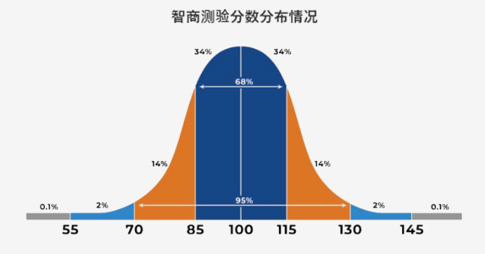

## 智力

---

### 智力及其发展

**智力**是指个人在认知功能方面的差异。根据美国心理学会（2000年）的定义，智力是“学习与适应的能力”，即通过学习获得的知识与技能，能够在新情境下应用的能力。具体包括：

1. 从经验中获得并应用知识的能力。
2. 理解并记忆信息、并在需要时进行再现的能力。
3. 判断并决策的能力。

#### 智力的发展

智力的发展通常随着年龄的增加而提升，并在60岁左右达到峰值。过去的研究认为年轻时期（20岁）是高峰期，但这主要是基于「流动性智力」的特点。近年来的数据表明，智力在60岁左右达到高峰。智力分为：

- **流动性智力**：与快速处理信息、逻辑推理有关，通常在年轻时达到顶峰，之后开始下降。
- **晶体性智力**：由言语、文化等累积经验形成，随着年龄增长而提高，60岁左右达到高峰。
---

#### Flynn效应

**Flynn效应**（弗林效应）是指在20世纪中期以来，全球范围内的智力测验分数呈现逐步上升的现象。这个现象以新西兰学者詹姆斯·R·弗林（James R. Flynn）的名字命名，他在20世纪80年代首先系统地记录并分析了这一趋势。

##### Flynn效应的特点
- **智商上升**：尤其是流动性智力的测量（如推理、逻辑等）中，智力测验分数显著提升。流动性智力通常反映的是抽象思维和解决新问题的能力。
- **稳定增长**：在多个国家和地区的智商测试结果中都观察到分数的逐步提升，说明这不仅是某个特定地区的现象。

##### 原因的假设
Flynn效应的原因尚未完全明确，但有多种可能的解释：
1. **教育水平的提升**：教育的普及以及教学方法的改进可能提高了学生在智力测验中的表现。
2. **营养状况的改善**：尤其在发达国家，饮食营养的改善被认为对儿童和青少年的智力发育有积极影响。
3. **现代社会的复杂性**：现代社会的工作和生活环境变得更加复杂，对人的抽象思维、问题解决能力提出了更高的要求，可能也提升了智力测试中的表现。
4. **健康与医疗条件的提高**：更好的医疗和卫生条件帮助人们更健康地成长和发展，间接支持了智力水平的提高。

##### 最近的趋势
值得注意的是，自20世纪末以来，在一些发达国家出现了Flynn效应减缓甚至智力分数下降的趋势。学者们对此进行了研究，并提出可能的解释，包括测试题内容与现代生活的不匹配、教育体系的变化以及环境因素的影响等。

### 智力的测量

可以使用以下方法：
- 比奈式
- 韦克斯勒式
- 莱文森式等

#### 比奈式
**比奈式智力検査**（Binet-Simon Test）是法国心理学家阿尔弗雷德·比奈（Alfred Binet）和西奥多·西蒙（Theodore Simon）在20世纪初开发的一种智力测量工具。其主要目的是评估儿童的智力发展水平，以便识别在普通教育系统中需要特殊帮助的儿童。比奈式智力検査在心理测量学和教育学上具有重要的历史意义，被认为是现代智力测验的开端。

- 比奈式智力検査的特点
    1. **精神年龄**的概念：比奈提出了“精神年龄”（Mental Age）的概念，指的是儿童在智力测试中表现出的认知发展水平，可以与其实际年龄（生活年龄）进行对比。
    2. **智商（IQ）公式**：比奈智力検査的结果后来被转化为智商（IQ），通过以下公式计算：
    $$
    \text{IQ} = \left( \frac{\text{精神年龄}}{\text{生活年齢}} \right) \times 100
    $$
    其中，生活年齢是指实际年龄，精神年龄是由测试得出的心理发育水平。

#### 田中比奈式智力検査
在比奈的原始测试基础上，日本心理学家田中寛一对其进行了修订，创建了适用于日本文化和教育体系的**田中比奈式智力検査**。这一版本在日本广泛使用，用于评估儿童和青少年的智力水平。

?> 比奈式智力検査最初是为教育系统设计的，目的是帮助识别需要特殊教育支持的儿童。随着智力研究的发展，它被广泛用于认知能力评估和智力研究的基础测量工具。

以下是图片内容的中文整理：

---

### 韦克斯ラー式智力检査

**Wechsler, D.（韦克斯勒）**将智力定义为“整体的适应性能力”，并开发了**韦克斯勒式智力检査**。该检査适用于不同年龄段，分为以下三种：
- **成人用**：WAIS（韦克斯勒成人智力量表）（Wechsler Adult Intelligence Scale）https://cn.wwiqtest.com/
- **儿童用**：WISC（韦克斯勒儿童智力量表）
- **幼儿用**：WPPSI（韦克斯勒学龄前和小学智力量表）

韦克斯勒式智力检査也被称为**诊断性检査**，用于诊断智力障碍。其测验结果可以适应大部分轻度智力障碍的检测，但不适用于重度障碍的检测。

#### 偏差智商指数（DIQ）
韦克斯勒检査中使用的智商指数是**偏差智商指数（DIQ）**，该指数的平均值设定为100，标准差为15。其公式为：

$$
\text{偏差智商指数DIQ} = 100 + 15 \times \left( \frac{\text{个体的得分 - 同年龄组的平均分}}{\text{同年龄组得分的标准偏差}} \right)
$$

#### 评价指标
在韦克斯勒检査中，智力分数的评价包括：
- **全体检査IQ（FSIQ）**
- **指標得点**（如一般的知觉能力指数GAI）

#### 具体指标
- 言语理解（VCI）
- 知觉推理（PRI）
- 工作记忆（WMI）
- 处理速度（PSI）

?>这些指标分为**言语性IQ**和**操作性IQ**，用于评估不同方面的认知能力。

言语性IQ和操作性IQ 

**言语性IQ**（Verbal IQ）和**操作性IQ**（Performance IQ）是韦克斯勒智力测试（如WAIS和WISC）中的两个主要构成部分，用于评估个体不同类型的认知能力。\
这两种IQ分别测量言语相关的能力和动手操作的能力，帮助全面了解个体的智力结构和认知特征。

#### 言语性IQ（Verbal IQ）
言语性IQ主要通过与言语和语言相关的任务来评估个体的智力水平，涉及词汇、理解、推理和抽象思维等方面。测试项目通常包括：
- **词汇**：考察个体对词汇的理解和表达能力。
- **常识**：评估日常生活中的知识储备和常识性理解。
- **理解**：测量个体在语言和情境中的理解力和判断力。
- **类同**：考察个体识别概念之间关系的能力。

言语性IQ通常能反映个体的语言理解、知识储备和逻辑推理能力，与学校教育的影响密切相关。

#### 操作性IQ（Performance IQ）
操作性IQ通过非言语性任务测量个体的动手能力、空间感知和视觉-运动协调能力等。测试项目通常包括：
- **积木设计**：评估空间构造和视觉分析能力。
- **图画拼凑**：考察视觉识别和整合能力。
- **图片排序**：测量个体对图像的逻辑排序能力。
- **符号替换**：评估处理速度和视觉-运动协调能力。

操作性IQ能够反映个体在非语言情境下的推理能力和问题解决能力，与实际操作任务和空间感知相关。

#### 言语性IQ和操作性IQ的意义
- **评估智力结构**：通过分别测量言语性IQ和操作性IQ，可以帮助区分个体的语言能力与非语言能力，全面了解个体的认知优势和弱项。
- **诊断和干预**：如果个体在言语性IQ和操作性IQ之间存在显著差异，这可能表明其在某方面存在学习障碍或认知偏差，有助于诊断和制定个性化的教育或干预方案。

在现代的韦克斯勒测试（如WAIS-IV）中，言语性IQ和操作性IQ概念逐渐被更细化的认知指数所替代，但它们仍是理解智力结构的重要概念。

---

### 智力相关理论

#### 智力二因子模型
**智力二因子模型**是由英国心理学家查尔斯·斯皮尔曼（Charles Spearman）提出的智力理论，他通过因子分析的方法研究发现智力可以分为两个主要成分，即**一般因子（g因子）**和**特殊因子（s因子）**。这个模型帮助解释了个体在不同认知任务中的表现差异，同时也奠定了智力研究的基础。

##### 智力二因子模型的主要内容

1. **一般因子（g因子）**：
   - **定义**：g因子代表的是一个人在所有认知任务中`共通的核心智力能力`。它是影响各类智力活动的基础。
   - **特点**：g因子反映了个体的抽象思维、推理能力、学习能力等，通常认为g因子是生来具备且稳定的智力因素。
   - **重要性**：在斯皮尔曼的理论中，g因子是个体智力的核心要素，影响着各类认知任务的表现。一个高g因子的人通常能够在多种智力测试中取得较好成绩。

2. **特殊因子（s因子）**：
   - **定义**：s因子指的是`特定任务或特定领域`所需的专门智力能力。它与g因子不同，是对某些特定类型任务的独特适应性。
   - **特点**：s因子是针对特定任务的能力，比如语言理解能力、数学计算能力、音乐才能等。在某一领域表现出色的人，通常在该领域的s因子较高。
   - **重要性**：s因子解释了为什么个体在特定任务上可能有不同的表现，即使g因子相同，s因子不同的个体在特定任务上的表现也可能不同。

##### 智力二因子模型的意义

- **区分一般智力和专业能力**：斯皮尔曼的二因子模型将智力分为共通的g因子和特定的s因子，使得智力结构更加清晰，便于理解个体在不同任务中的表现差异。
- **推动智力研究的发展**：g因子的概念引发了后续对一般智力的广泛研究，成为智力测验的基础理论之一。
- **应用于智力测验**：现代的智力测验通常设计为既能测量个体的一般智力水平（g因子），又能评估特定领域的能力（s因子），提供更全面的认知能力评估。

斯皮尔曼的二因子模型虽然简单，但对后续智力理论的发展具有深远影响，比如瑟斯顿的多因素理论、卡特尔的流体智力与晶体智力理论等。

---

#### 智力的多因子模型（瑟斯顿）

**Thurstone, L.L.（瑟斯顿）**通过对大学生和中学生的智力检査分析，提出智力由8到10个独立的认知能力因子构成的**多因子论**。瑟斯顿的模型包括以下7个主要因子：

1. **言语理解**（V）
2. **词的流畅性**（W）
3. **空间**（S）
4. **知觉的速度**（P）
5. **数**（N）
6. **记忆**（M）
7. **推理**（R）

瑟斯顿指出，这些因子彼此独立，但可能含有共同的一般因子。

---

#### 流动性智能与晶体性智能（卡特尔）

**Cattell, R.B.（卡特尔）**认为一般智力可以分为两种类型：
1. **晶体性智能**：受文化和教育影响较大的知识和技能，随着年龄增长而提升。
2. **流动性智能**：较少受文化影响的抽象思维和解决新问题的能力，通常在年轻时较强，随后逐渐下降。

---

#### 智能的三元理论（斯滕伯格）

**Sternberg, R.J.（斯滕伯格）**提出智力可以分为：
1. **分析性智力**：处理问题和评估的能力。
2. **創造性智力**：应对新事物的能力。
3. **实际性智力**：适应环境和处理日常事务的能力。

以下是图片内容的中文整理：

---

#### 多重智力理论（加德纳）

**Gardner, H.（加德纳）**提出，每个人都有一组不同的**多重智能（Multiple Intelligences，简称MI）**，至少包括8种相对独立的智力类型，每种智力都可以通过适当的教育和培养得到发展。

以下是8种多重智力及其相关的职业：

| 智能类型     | 智能的说明                                                 | 相关职业                     |
| ------------ | ---------------------------------------------------------- | ---------------------------- |
| 语言的智力   | 运用语言进行沟通的能力，如写作、阅读、口语表达等             | 作家、演说家、律师等         |
| 逻辑-数学智力| 数学推理、分析和解决问题的能力                               | 数学家、科学家               |
| 音乐智力     | 理解和创造音乐的能力                                       | 音乐家、作曲家               |
| 身体-动觉智力| 控制身体动作和使用物体的能力                                 | 运动员、演员、工匠           |
| 空间智力     | 感知和操控空间的能力                                       | 飞行员、雕塑家、建筑师       |
| 人际智力     | 理解他人情感和与他人互动的能力                              | 教师、心理学家、政治家       |
| 内省智力     | 自我认识、自我理解的能力                                   | 哲学家、心理学家             |
| 自然观察智力 | 识别自然界事物的能力                                       | 生物学家、环保主义者         |

加德纳的多重智力理论指出，智力不仅局限于传统的语言和数学，还包括其他多样化的认知能力。

## 性格（personality）

### 什么是性格（パーソナリティ）

**性格（パーソナリティ）**是指拥有心理和身体特征的个体内在性格系统，其会随着状况或经验而逐渐变化，同时影响着个体对他人的态度和回应。Allport（奥尔波特）指出，性格是指“个体内在的心理-物理系统，这些系统决定了个人的思想、情感和行为的独特适应方式”。

性格通常会以一定的行为、思考、情绪反应方式来表现，并受到环境和遗传的影响。

性格的概念来自拉丁词汇“persona”（面具），最初指个体在社会中的角色或外部印象。然而，现代性格研究并不局限于外部表现，而是将性格视为个体特质的整体集合，包括性格和气质等多方面因素。

#### 性格与气质

**气质（temperament）**：气质指的是生来就具有的情绪特征和反应模式，是性格的基础组成部分之一。气质倾向于受到遗传影响且相对稳定。

例如，A. Thomas和S. Chess通过“纽约纵向研究”将气质分为以下几个维度：活动水平、节律性、趋避性、适应性、反应强度、反应阈、情绪本质、注意分散性和持久性。此外，气质还可以通过三种典型类型来分类：**容易养育型**、**困难型**和**反应缓慢型**。

性格的维度可以大致分为以下几类：
- **情绪性**
- **自我控制性**
- **活力水平**

这些维度通常用于研究和分析性格的不同方面。

---

### 性格理论的类型

在性格研究中，最有代表性的两种理论是**特质理论**和**类型理论**，这两种理论在人格特性理解上存在差异。

#### 特质理论
- **定义**：特质理论认为，人类的人格是由`内在一致的特质所构成`的，这些特质在不同情境中表现稳定。特质理论注重描述人格的不同维度，认为人格可以用特质来分解和测量。
- **特点**：特质是持久而稳定的，适用于描述个体间的差异。
- **代表理论**：包括克雷奇默（Kretschmer）的性格分类理论、谢尔顿（Sheldon）的体型理论、尤洛内的性格类型理论等。

#### 类型理论
- **定义**：类型理论认为，人类的个性可以`归类为不同的类别或类型`，每种类型具有特定的行为和特征。
- **特点**：类型具有分类性，更倾向于将个体归属于某一特定的类型。
- **代表理论**：包括奥尔波特的特质理论、艾森克的人格维度理论、卡特尔的16因素人格理论、五大人格模型（Big Five）以及Cloninger的7因子人格模型等。

---
### 性格类型论
#### 与体型相关的性格类型论

1. **Kretschmer, E.（克雷奇默）的性格类型理论**：
    克里ッチ马克根据精神病患者的体型特征，将性格分为以下三种类型：
    1. **细瘦型**：分裂气质，特质为内向、敏感、非社交。
    2. **肥胖型**：循环气质，特质为外向、愉快、社交。
    3. **肢体型**：粘液气质，特质为稳重、可靠、适应力强。

2. **Sheldon, W.H.（谢尔顿）的性格类型理论**：
    谢尔顿基于克里奇马克的研究，提出体型与气质的关系，并进一步将体型与性格特质关联起来。谢尔顿将体型分为：
    1. **外胚层型**（细瘦型）：神经质型气质，特质为内向、敏感。
    2. **内胚层型**（肥胖型）：循环型气质，特质为社交、愉快。
    3. **中胚层型**（肌肉型）：身体型气质，特质为冒险、积极。

---

#### 与精神相关的性格类型论

1. ***施奈德的性格类型论***

    **Schneider, K.（施奈德）**将精神病质定义为“因自身异常而痛苦”或“因其异常对社会造成困扰”的人格特质，并将其分为以下十种类型：

    - **自身异常而痛苦的类型**：
        - 自己显示型
        - 郁闷型
        - 自信欠如型
        - 无力型
        - 气分变型

    - **对他者造成困扰的类型**：
        - 高志欠如型
        - 发愁型
        - 偏爱型
        - 信任欠如型
        - 拒否型

2. ***荣格的内向性与外向性理论***

    - **荣格（Jung, C.G.）**的性格理论关注**内向**与**外向**两个方向。

        - **内向性**：个体将心理能量指向内部，对内在世界关注的倾向。
        - **外向性**：个体将心理能量指向外部，对外在世界关注的倾向。

    - 荣格将这两种性格倾向与四种心理功能的组合，归纳为**八种类型**。心理功能分为**两类四种**：

        1. **理性功能**：判断和决策的功能，包括思考和情感。
            - **思考**：逻辑分析的功能。
            - **情感**：价值判断的功能。

        2. **非理性功能**：知觉的功能，包括感觉和直觉。
            - **感觉**：基于感官的现实认知。
            - **直觉**：不依赖感官的潜在可能性认知。

        这些功能中较强的一种为主导功能，另一种次要功能为辅助功能。

### 性格特性论

在特质论的研究中，**奥尔波特**、**艾森克**、**卡特尔**和**格雷**是四位重要的心理学家，他们各自提出了关于人格特质的不同理论。这些理论对理解个体的人格特质及其差异性提供了重要的框架。

#### 1. 奥尔波特（Allport, G.W.）的性格理论
- **共通特质与个人特质**：奥尔波特认为，每个人格都是独特的，由一组特质构成。他将人格特质分为「共通特质」（在群体中普遍存在的特质）和「个人特质」（个体独有的特质）。
- **机能自主性**：奥尔波特提出「机能自主性」概念，认为人的行为在发展过程中可以超越原有的动机和目的，表现出独立的、自主的行为模式。
- **词表法**：奥尔波特采用词表法分析人格特质，从词汇中提取描述人格的词语，以揭示人格特征。

#### 2. 艾森克（Eysenck, H.J.）的性格理论
- **三大人格维度**：艾森克提出了三大人格维度——「内向-外向」、「神经质（情绪稳定性）」和「精神质（情绪控制）」。他认为这些维度是人格的基本要素，可以解释个体在情绪稳定性和社会适应方面的差异。
  - **内向-外向**：指个体在社交活动和外部刺激中的表现。
  - **神经质**：反映个体情绪的稳定性。
  - **精神质**：涉及情绪控制和社会规范的遵循程度。
- **生物学基础**：艾森克认为人格有生物学基础，不同人格特质与大脑的不同区域和生理机制有关。
- **MPI量表**：艾森克开发了莫雷尔-艾森克人格问卷（MPI），用于测量这些人格维度。

#### 3. 卡特尔（Cattell, R.B.）的性格理论
- **16种人格特质**：卡特尔通过因素分析法，提出了16种人格特质（16PF），并设计了「16PF人格问卷」来评估这些特质。这些特质包括温暖、自我控制、稳定性、活力等。
- **表面特质和根源特质**：卡特尔区分了「表面特质」（在行为上表现出来的特质）和「根源特质」（更深层、稳定的特质），后者是人格的核心成分。
- **因素分析**：卡特尔利用因素分析技术来识别和提取人格结构中的关键特质。

#### 4. 格雷（Gray, J.A.）的强化敏感性理论
- **行为系统理论**：格雷提出行为激活系统（BAS）和行为抑制系统（BIS）的理论，解释个体对奖励和惩罚的敏感性。
  - **BAS（行为激活系统）**：对奖励敏感，推动个体接近目标或追求积极的刺激。
  - **BIS（行为抑制系统）**：对惩罚敏感，促使个体避免危险或消极刺激。
- **神经心理学基础**：格雷的理论建立在神经心理学基础上，认为人格中的焦虑和冲动等特质可以通过BAS和BIS系统的活动水平来解释。
- **人格与情绪的关系**：格雷的理论强调人格特质与情绪反应之间的关系，解释了为什么个体在面对不同情境时会表现出不同的情绪和行为模式。

#### 总结
- **奥尔波特**注重个体独特性，强调人格特质的独特组合。
- **艾森克**聚焦于人格的生物学基础，提出了三大人格维度。
- **卡特尔**通过因素分析提出16种核心人格特质，提供了系统的评估工具。
- **格雷**的强化敏感性理论解释了个体对奖励和惩罚的不同敏感性，拓展了人格特质的神经心理学视角。 

这些理论为理解人格特质的结构和发展提供了不同的视角，并在人格心理学中产生了深远影响。

---

#### 
 五大人格特质理论（Big Five）与克隆宁格 

#### **五大人格特质理论（Big Five）**  
五大人格特质理论（Big Five）由L.R. Goldberg、McCrae和Costa等人提出，是当前应用最广泛的性格特质理论之一。它将人格分为五个基本维度，每个维度包含多个下位特质。常用的评估工具包括**NEO-PI-R**和**NEO-FFI**。

##### 五大人格特质维度及其下位特质

| 特质维度 | 下位特质 |
| -------- | -------- |
| **N：神经质**（Neuroticism） | 不安、敌意、抑郁、自尊低、情绪性、容易受伤 |
| **E：外向性**（Extraversion） | 温暖、群居性、断言性、活力、刺激需求、积极情绪、爱冒险 |
| **O：开放性**（Openness to Experience） | 空想、审美性、情感丰富、探险、创造力、价值观 |
| **A：调和性**（Agreeableness） | 信赖、真诚、利他、依从、谦虚、同情心、温柔 |
| **C：谨慎性**（Conscientiousness） | 勤勉、秩序、尽责、成就追求、自律、谨慎 |

五大人格特质通常记为**N、E、O、A、C**。

---

#### 克隆宁格的7次元模型

**克隆宁格（Cloninger, C.R.）**将人格特质分为「气质」和「性格」两大类，用以解释人格在生理基础上对环境和经历的反应模式。这一模型是人格心理学的一个重要理论，被用于**气质性格评定量表（TCI）**的构建。

##### 「气质」的四个维度
1. **新奇追求**（与多巴胺系统相关）
2. **伤害回避**（与5-羟色胺系统相关）
3. **奖赏依赖**（与去甲肾上腺素和5-羟色胺系统相关）
4. **坚持性**（与5-羟色胺系统相关）

##### 「性格」的三个维度
1. **自我导向**
2. **合作性**
3. **自我超越**

这些维度用于描述人格特质在气质（生理基础）和性格（心理成熟）方面的不同特性。

---
### 学習理論、パーソナル・コンストラクト理論、认知-情绪系统理论

**学習理論**和**パーソナル・コンストラクト理論（个人建构理论）**、以及**认知-情绪系统理论**是人格心理学中的重要理论，分别从行为主义和认知建构的角度理解人格的发展与表现。

#### 
学習理論

学习理论基于行为主义的观点，认为人格特质是通过与环境的互动习得的。人格不是内在固定的特质，而是通过强化、惩罚和条件反射等学习过程形成的行为模式。

1. **斯金纳（Skinner, B.F.）**的观点：
   - 斯金纳认为人格是由一系列的习得行为组成的，这些行为是在环境的强化（奖励）或惩罚下逐步形成的。
   - 他强调环境的控制作用，通过正强化和负强化来塑造个体的行为。
   
2. **华生（Watson, J.B.）**的观点：
   - 华生作为行为主义的创始人之一，认为人的行为主要通过学习形成。他强调环境对人格发展的影响，认为通过条件反射的过程可以塑造个体的行为反应。
   - 华生认为人格可以在没有内在心理特质的假设下，仅通过外部刺激和反应来理解。

#### 
パーソナル・コンストラクト理論（个人建构理论）

个人建构理论由乔治·凯利（George A. Kelly）提出，是一种认知心理学取向的理论。该理论认为，人类以独特的方式建构和理解世界，每个人的思维模式、态度和行为都是通过个人建构系统形成的。

1. **核心概念**：
   - **个人建构**：指的是个体用来解释、预测和控制生活事件的认知框架。每个人对外部世界的理解都是通过一套独特的建构系统来进行的。
   - 这些建构系统通过不断的经验修正而发展，个体会通过对建构系统的“测试”来调整和改善对外部世界的理解。

2. **理论要点**：
   - 凯利认为，个体会根据建构系统来预测和解释周围的事物。通过不断的“测试”和“验证”，个体的建构系统得以修正和完善。
   - 个人建构理论强调的是个体的主观体验，每个人都有一套独特的建构体系去适应和解释现实。

#### 
 认知-情绪系统理论

**认知-情绪系统理论（Cognitive-Affective Processing System, CAPS）**是由心理学家沃尔特·米歇尔（Walter Mischel）提出的一种人格理论，用于解释个体如何在不同情境中表现出稳定而又具有灵活性的行为。CAPS理论强调人格不仅仅是稳定的特质，而是由认知和情绪的相互作用所决定的，受情境的影响表现出个体化的行为模式。

CAPS理论提出，个体的行为是由一组相互关联的认知和情绪单元（cognitive-affective units, CAUs）组成的系统来决定的。CAUs包括以下几类：

1. **编码（Encodings）**：
   - 个体对外部环境和内部信息的解读方式，包括对情境、事件、自我、他人的看法。
   - 编码影响个体对情境的认知理解，决定个体对信息的筛选和处理方式。

2. **期望和信念（Expectancies and Beliefs）**：
   - 个体对未来结果的期望和对自我能力的信念。它们会影响个体的动机水平和行为选择。
   - 例如，如果一个人对自己的成功充满信心，那么他在面对挑战时会更积极主动。

3. **情绪（Affects）**：
   - 个体的情绪和情感反应，包括对特定情境的情绪反应。
   - 情绪在个体的决策和行为选择中起到关键作用。

4. **目标与价值观（Goals and Values）**：
   - 个体的目标、价值观和动机系统，会引导个体朝着特定方向努力。
   - 这些目标和价值观为个体提供行为的目的和动力。

5. **自我调节计划（Self-Regulatory Plans）**：
   - 个体的自我控制和行为调节策略，包括应对困难情境的方法。
   - 通过自我调节，个体能够在面对挑战和冲突时维持其行为的一致性和适应性。

#### CAPS的工作原理

CAPS理论认为，当个体进入特定情境时，情境中的信息会被个人的CAUs（认知-情绪单元）激活，这些单元之间的相互作用决定了个体的行为反应。不同的情境会激活不同的CAUs，因此个体在不同情境中的表现也会有所不同，但由于个体的CAUs系统相对稳定，因此在类似情境中表现出稳定的行为模式。

#### CAPS理论的特点

1. **情境依赖性**：CAPS理论强调个体行为的情境依赖性，认为人格不是固定不变的，而是会随着情境的变化而表现出不同的行为。
   
2. **跨情境一致性**：虽然个体在不同情境中表现可能会不同，但CAPS理论指出，在类似情境下，个体会表现出一致的反应方式，即一种“情境一致性”的行为模式。

3. **认知与情绪的相互作用**：CAPS理论强调认知和情绪的相互作用，这种动态系统会根据情境变化而激活不同的认知和情绪单元，产生个体化的行为反应。

#### 总结
- **学习理论**关注外部环境对行为和人格的塑造，强调通过强化、惩罚等外部因素影响个体行为的形成。
- **个人建构理论**则从认知的角度探讨人格，认为个体通过认知框架（建构系统）理解和预测世界，强调人格的主观性和独特性。
- **CAPS理论**对人格研究、情绪调节、自我控制和应对压力等领域具有重要意义。通过理解个体在不同情境下的CAUs激活模式，可以更准确地预测和解释个体的行为表现，同时有助于个体的行为干预和自我调节策略的制定。

### 人格（性格）测试

**人格测验**的方法主要分为**问卷法**、**投影法（投映法）**和**作业测验法**。这些方法各有特点，适用于不同的评估目的和应用场景。

#### 
1. 问卷法（質問紙法）

问卷法是最常用的人格测验方法之一，使用一系列结构化的问题来评估个体的人格特质。被试根据预设问题进行回答，通过这些回答来分析人格特质。

- **特点**：
  - 题目是固定的，通常以选择题或量表题的形式呈现。
  - 回答方式包括**选择性回答**（如多项选择题）和**自由回答**（需要被试自发性回答）。
  - 测验具有标准化、简便和易于实施的特点，适合大量人群的筛查。

- **常见的问卷测验**：
  - **YG性格测定**（矢田部-吉尔福德性格测验）：用于评估多种性格特质。
  - **MMPI**（明尼苏达多项人格问卷）：广泛用于临床人格评估，测量多种人格维度和心理症状。
  - **NEO-PI-R**：基于五大人格特质理论，评估外向性、情绪稳定性、开放性等五大维度。

#### 
2. 投影法（投映法）

投影法通过模糊、非结构化的刺激（如图片、故事情境等）来诱发被试的内在心理反应，从而揭示潜在的人格特质。被试在面对这些模糊的刺激时，倾向于将自己的情感、动机和需求投射到回答中。

- **特点**：
  - 被试的反应更自由，不受限制，反映了潜意识和内在冲突。
  - 适合探讨深层次的心理特征，如情绪状态、动机和心理防御机制。
  - 测验的解释需要专业人员，结果受测验者的主观性较大。

- **常见的投影法测验**：
  - **罗夏墨迹测验**：让被试解释一系列墨迹图形，用于揭示潜意识中的心理特质。
   url: https://www.idrlabs.com/cn/rorschach/test.php
  - **主题统觉测验（TAT）**：让被试观察图片并编故事，分析情绪和动机。
  - **句子完成测验（SCT）**：被试补充不完整的句子，揭示内在的想法和情感。
  - **P-F研究法**：用于测量个体对压力情境的反应。
  - **风景构成法**和**绘画测试**：让被试通过绘画表达内心情感和特质。

#### 
3. 作业法（作業検査法）

作业测验法通过让被试完成特定的作业任务，根据作业完成的方式、速度和质量来推断其人格特质。此方法关注的是个体在任务执行中的行为模式和反应特点。

- **特点**：
  - 被试的反应更接近实际生活情境。
  - 适合评估个体的注意力、耐心、工作效率和应对能力。
  - 主要应用于临床和职场心理评估。

- **常见的作业测验法**：
  - **内田-克莱佩林作业测验**：让被试进行简单的加法运算，以测量注意力、持续性和反应速度等特质。

#### 
问卷法与投影法的比较

**问卷法**和**投影法**在人格测验中各有优势和缺点，两者在不同的评估对象和情境中具有互补作用。

| 比较内容 | 问卷法 | 投影法 |
| -------- | ------ | ------ |
| **检查对象** | 意识层面的把握 | 无意识面，或前意识的把握 |
| **长所（优点）** | - 测验时间短，对被测者的精神和时间负担较小 - 被测者的熟练度要求不高，实施方便 | - 回答难以被被测者刻意扭曲 - 不受被测者语言能力的影响 |
| **短所（缺点）** | - 被测者可能会歪曲回答（社会期望偏差） - 对语言能力或理解能力有要求，可能导致个体差异 | - 心理负担较大，测试时间较长 - 结果的分析和解读较复杂，费时费力 |

问卷法适合短时间内进行标准化评估，而投影法更关注深层次的无意识内容，但需要更多专业知识进行解读。

#### 总结
- **问卷法**：结构化、易于实施，适合大规模筛查和标准化评估。
- **投影法**：通过自由反应揭示深层次心理，适合个性化和深度评估。
- **作业测验法**：通过任务完成情况来分析人格特质，适用于评估实际行为和任务表现。

这三种方法在不同的场合下各有应用，通常在临床心理学、教育、职业评估等领域中组合使用，以获得全面的心理与人格评估结果。

---

#### 
测试电池（Test Battery）

**测试电池（Test Battery）**是指将多种心理测验组合在一起，以全面评估个体的多方面特征。由于单一测验只能评估某一特定方面，测试电池通过不同类型测验的组合，提供更加综合、深入的心理与人格信息。这种方法通常用于临床心理学、教育心理学和职业评估等领域。

#### 测试电池的特点

- **多维度评估**：测试电池可以涵盖人格特质、智力、情绪状态、适应性等多个方面，帮助提供个体的全貌。
- **组合灵活**：根据测评的目标和被测者的特点，测试电池的组成可以灵活调整。选择合适的测验组合能够有效节省时间和成本。
- **提高准确性和可靠性**：通过多种测验结果的相互验证，可以减少单一测验的局限性，提高评估的精确度和信度。

#### 测试电池的组成方式

测试电池通常包括以下三种测验方法的组合：

1. **问卷法**：结构化的自我报告问卷，用于评估个体的基本人格特质和情绪状态。
   - 常用测验：MMPI（明尼苏达多项人格测验）、NEO-PI-R（五大人格量表）、YG性格测验等。

2. **投影法（投映法）**：模糊或不明确的刺激，个体通过自由反应揭示潜意识的情感、动机和内在冲突。
   - 常用测验：罗夏墨迹测验、主题统觉测验（TAT）、句子完成测验（SCT）等。

3. **作业测验法**：通过特定任务的完成情况来观察个体的注意力、耐心和反应特点。
   - 常用测验：内田-克莱佩林作业测验、韦氏智力量表（WAIS）、儿童智力量表（WISC）等。

#### 测试电池的应用示例

1. **临床心理评估(精神科)**：通常采用`MMPI（明尼苏达多项人格问卷）、罗夏墨迹测验（投影法）、HTP（绘画法）、WAIS（智力检查）`等组合，用于全面了解患者的情绪状态、智力水平和潜在的心理障碍。
   
2. **教育心理评估**：针对学生的适应性、情绪稳定性，常用`YG性格测验、集体适应性测验、儿童智力量表（WISC）`等。

3. **职业评估**：在招聘和职业适应性测试中，常用人格问卷、情绪评估和作业测验来预测候选人的适应能力和工作表现。

#### 心理检査的留意点

在实施测试电池时，评估者应秉持“支持被测者”的态度，避免过度评价或产生负面影响。测试的目的是帮助被测者了解自身，并提供适当的支持和建议。

---

> 本页面主要源于（日本心理学学习网站）：https://psychologist.x0.com/index.html ; 
> 以及网络上知识的整理，不涉及商业用途，仅供个人使用