## 概率和性质

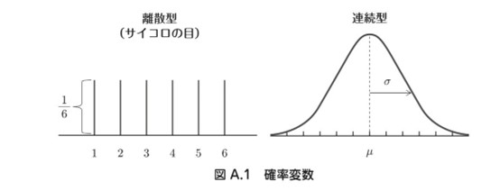

- 分为离散型和连续型概率分布

---------------------------------------------
## 离散型概率分布

### 伯努利分布

- 是一种最简单的离散概率分布，描述了只有两种可能结果的实验或随机试验。它通常用于建模成功（或事件发生）与失败（或事件未发生）的情况 

	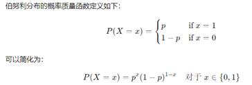

  

###  二项分布

- 用于描述在固定次数的独立试验中成功的次数。这些试验被称为伯努利试验，每次试验都有相同的成功概率。

	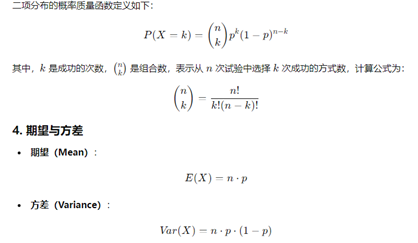

###  几何分布

- 描述在进行独立的伯努利试验中，直到首次成功所需的试验次数。它主要用于建模成功发生的第一个试验之前失败的次数。

	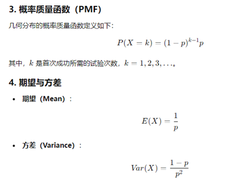

###  泊松分布

- 描述在给定时间间隔或空间区域内某事件发生的次数。它通常用于建模稀有事件的发生，例如客户到达、电话呼入、故障发生等。

	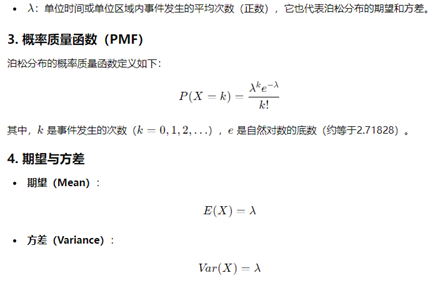

  

## 连续型概率分布

###  正态分布
- 应用最为广泛的分布

	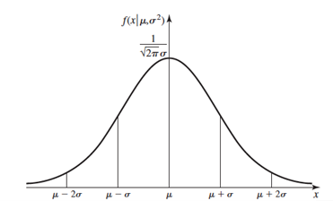

  
*** 
###  指数分布

- 常用于描述独立随机事件之间的时间间隔或等待时间。它是一种重要的分布，尤其在可靠性工程、排队理论和生物统计学等领域具有广泛的应用。

  

###  均匀分布

- 其中所有可能的值在某个特定范围内均等地发生。均匀分布可以是离散的或连续的，具体取决于随机变量的取值范围。

	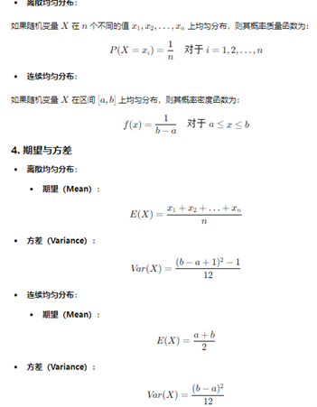

  

###  卡方分布
- 卡方分布公式

	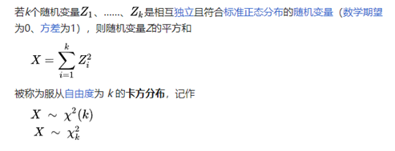

- 卡方分布图

	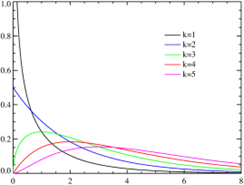

###  t分布
	t 分布（Student's t-distribution）的原理可以通过其推导过程和特性来理解。以下是 t 分布的基本原理：

-  1. 推导背景
	t 分布由 William Sealy Gosset（笔名“Student”）在 1908 年提出，主要用于小样本的统计推断。其推导基于以下几个重要的概念：

	- **正态分布**：当样本量足够大时，样本均值的分布接近正态分布（中心极限定理）。
	- **样本标准差**：在小样本情况下，使用样本标准差而非总体标准差来估计误差。这导致了更高的不确定性。

-  2. 公式推导
	t 分布的随机变量 \( t \) 定义为：
	t 分布的随机变量 $t$ 定义为：
    
	$$ t = \frac{\bar{X} - \mu}{S / \sqrt{n}} $$

	其中：
	- $\bar{X}$ 是样本均值。
	- $\mu$ 是总体均值。
	- $S$ 是样本标准差。
	- $n$ 是样本量。
 ***
- 3. 随机变量的性质
	- **标准化**：t 分布将样本均值与总体均值的差异标准化，考虑了样本的变异性。
	- **自由度**：自由度 $ df $ 通常为 $ n - 1 $，表示样本量减去1。这决定了 t 分布的形状。

- 4. t 分布的特性
	- **对称性**：t 分布是一个对称的分布，均值为0。
	- **尾部厚度**：t 分布比标准正态分布有更厚的尾部，意味着在小样本情况下，极端值（异常值）的影响更为显著。
	- **逐渐接近正态分布**：当自由度增大时，t 分布会逐渐接近标准正态分布，通常在自由度大于 30 时几乎无差异。

-  5. 应用
	t 分布的原理被广泛应用于假设检验和置信区间估计，特别是在以下情况下：
	- **小样本**：当样本量小于 30 时。
	- **未知方差**：当总体方差未知，而需要用样本标准差估计时。

- 总结
	t 分布提供了一种处理小样本和不确定性的有效方法。通过样本均值、样本标准差和自由度的结合，t 分布使得研究人员能够在统计推断中考虑到样本的变异性和不确定性，从而进行更准确的假设检验和置信区间估计。

###  F分布
	F 分布（F-distribution）是由英国统计学家 Ronald Fisher 提出的，主要用于统计推断中的方差分析和假设检验，特别是用于比较两个样本的方差。

-  F 分布的定义
	F 分布是两个独立的卡方分布的比值。若随机变量 $ X $ 和 $ Y $ 分别服从自由度为 $ d_1 $ 和 $ d_2 $ 的卡方分布，则 F 分布定义为：

	$$
	F = \frac{(X / d_1)}{(Y / d_2)}
	$$

	其中，$ d_1 $ 和 $ d_2 $ 分别为分子和分母的自由度。

-  F 分布的性质
	1. **非对称性**：F 分布是非对称的，且形状随着自由度 $ d_1 $ 和 $ d_2 $ 的变化而变化。
	2. **正偏性**：F 分布是正偏的，意味着它在右尾处有更长的尾巴。
	3. **非负性**：F 分布的值始终为非负数，因为它是两个平方和的比率。
	4. **自由度的影响**：随着自由度 $ d_1 $ 和 $ d_2 $ 的增大，F 分布逐渐向正态分布靠近。

-  应用场景
	F 分布在统计学中主要用于以下方面：

	1. **方差分析（ANOVA）**：用于检验多个样本是否来自相同的总体。通过比较组间变异和组内变异来判断总体均值是否相等。
   
	2. **回归模型的显著性检验**：在回归分析中，使用 F 检验来检验整个模型的显著性，即判断自变量是否对因变量有显著影响。

	3. **两组方差的比较（F 检验）**：用于检验两个独立样本的方差是否相等。

-  F 分布的假设检验过程
	假设我们进行方差分析时使用 F 分布，其步骤通常如下：

	1. **提出假设**：零假设 $ H_0 $ 假设各组均值相等，备择假设 $ H_1 $ 假设至少有一组均值不同。
   
	2. **计算 F 值**：通过分子自由度和分母自由度，计算出实际的 F 统计量。

	3. **查找临界值**：在指定的显著性水平（如 0.05）下，根据 $ d_1 $ 和 $ d_2 $ 的自由度，查找相应的 F 分布临界值。

	4. **得出结论**：将计算出的 F 值与临界值进行比较，如果 F 值大于临界值，拒绝零假设，说明组间均值存在显著差异。

-  总结
	F 分布在统计推断中扮演了重要角色，尤其在方差分析和模型显著性检验方面。通过比较方差之间的比值，F 分布提供了一种有效的方法来分析和判断数据集之间的差异性。

******

## 统计的推测

### i. 样本分布

- 1.平均数为μ，方差为σ2的母集团抽出n个的简单抽样样本【x1,x2,x3…xn】

- 2.样本分布的平均值称为“样本均值”。样本均值的公式为： 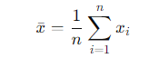

- 3.母体分布的平均值通常称为“总体均值”或“期望值”，记作
	母体分布的均值公式为：
	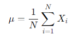

- 4.样本均值的性质:

	a)无偏性：样本均值是总体均值的无偏估计量，即 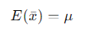

	b)方差：样本均值的方差为： 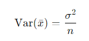

- 5.中心极限定理

	中心极限定理指出，随着样本量 n 的增加，样本均值的分布将趋近于正态分布，即使母体分布是非正态的。
	当样本量足够大时，样本均值 将近似服从正态分布:

	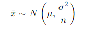

***

### ii. 置信区间（信頼区間）

- 1. 根据选择的置信水平查找临界值。对于正态分布，可以使用 Z 分数；对于小样本或未知母体标准差的情况，通常使用 t 分数。

- 2. 由中心极限定理构造统计量：

	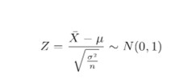

- 3. 选择一个置信水平（通常为95%或99%），这将影响置信区间的宽度。

- 4. 查找临界值	
	根据选择的置信水平查找临界值。对于正态分布，可以使用 Z 分数；对于小样本或未知母体标准差的情况，通常使用 t 分数。Z 分数（95%置信水平）：约为1.96）
	
	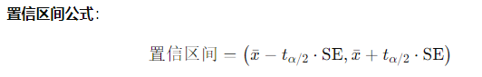

- 5. 结论   

- 6. 例子

	假设我们从一个母体中随机抽取了30个样本，计算得到的样本均值为 50，样本标准差为 s=10。我们想要构建95%的置信区间。

	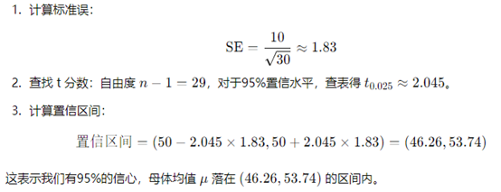

### iii.假说检验（仮説検定）

- 1. 提出假设

	a)零假设（Null Hypothesis）：这是需要检验的初始假设，通常表示没有效果或没有差异。例如：

	

	b)备择假设（Alternative Hypothesis）：这是与零假设相对立的假设，表示存在效应或差异。例如：

	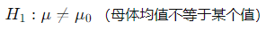

- 2. 选择显著性水平

	a) 显著性水平（Significance Level, α\alphaα）是判断零假设是否被拒绝的标准，常用的值为0.05、0.01等。

	b) 如果 α=0.05，表示在95%的置信水平下进行检验。

- 3. 选择适当的检验方法

	a) 根据数据类型和假设类型选择合适的统计检验方法，如：

	b) t检验：用于比较两个均值（单样本t检验、独立样本t检验、配对样本t检验）。

	c) 方差分析（ANOVA）：用于比较多个均值。

	d) 卡方检验：用于分类数据的频率分布。

	e) 非参数检验：在数据不满足正态分布假设时使用。

- 4. 计算检验统计量
	根据选择的检验方法计算检验统计量（Test Statistic））

	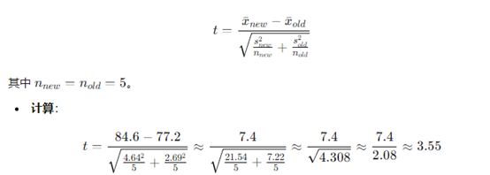

  
	对于单样本t检验：

	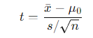

  
	双样本t检验:

	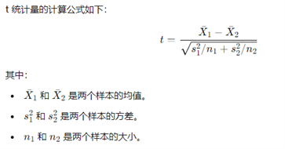

- 5. 确定临界值和决策规则

	a) 根据显著性水平和所选的检验方法查找临界值：

	b) 如果检验统计量落在拒绝域内，拒绝零假设；否则，不拒绝零假设。

	c) 例如：对于双侧检验，拒绝域通常在左右两侧；对于单侧检验，拒绝域只在一侧。

### 举例：假设：检验新教学方法对学生数学成绩的效果。

- 1. 零假设 H0：新教学方法对学生数学成绩没有影响（母体均值 μ 等于传统教学方法的均值）（μ=μ0​）。

	

- 2. 备择假设 H1：新教学方法对学生数学成绩有影响（μ≠μ0​）。

	

- 3. 样本数据：抽取5名学生，新教学方法前后的数学成绩变化，计算样本均值和标准差。

- 4. 假设我们收集了两组数据：
	使用新教学方法的学生成绩：[78,85,90,82,88]

	使用传统教学方法的学生成绩：[75,80,78,74,79]

	计算样本均值和样本标准差：

	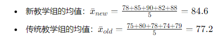

	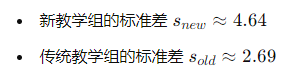

- 5. 显著性水平：选择 α=0.05。（95%的置信区间）

- 6. 选择检验：使用独立样本t检验。

- 7. 计算检验统计量，并查找t分布表得到临界值。

	

- 8.确定临界值和决策规则

	

- 9.结论

	比较检验统计量与临界值：计算得到的 t 值 3.553 大于临界值 2.3062

	拒绝零假设 H0，这表明有足够的证据支持新教学方法对学生数学成绩有显著影响。
